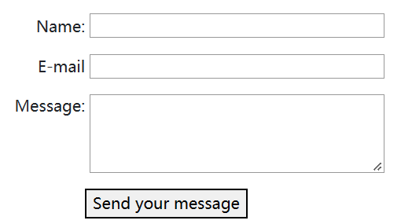

## [web 表单是什么？](https://developer.mozilla.org/zh-CN/docs/Learn/Forms/Your_first_form#web_表单是什么？)

web 表单是用户和 web 站点或应用程序之间交互的主要内容之一。它们允许用户输入数据，大多数情况下会将数据发送到 web 服务器进行处理和存储（见后面的章节[发送表单数据](https://developer.mozilla.org/zh-CN/docs/Learn/Forms/Sending_and_retrieving_form_data)），或者在客户端使用某种方式立刻更新界面（例如，添加列表中的另一个项目，或者显示或隐藏 UI 功能）。

web 表单是由一个或多个**表单控件**（有时称为**小部件**），以及一些有助于构建整个表单的附加元素组成——通常被称为 **HTML 表单**。这些控件可以是文本字段（单行或多行）、选择框、按钮、复选框或单选按钮，大部分是使用 [``](https://developer.mozilla.org/zh-CN/docs/Web/HTML/Element/Input) 元素创建的，尽管还有一些其它元素需要学习。

还可对表单控件进行编程，以强制指定输入的格式和值（**表单验证**），并与文本标签配对，向有视力障碍的用户描述其用途。

## [设计表单](https://developer.mozilla.org/zh-CN/docs/Learn/Forms/Your_first_form#设计表单)

在开始编写代码之前，最好先退一步，花点时间考虑一下你的表单。设计一个快速的模型将帮助你定义你想要询问用户的正确的数据集。从用户体验（UX）的角度来看，要记住：表单越大，失去用户的风险就越大。保持简单，保持专注：只要求必要的数据。

在本文中，我们将构建一个简单的联系人表单。让我们做一个粗略的草图。


我们的表单将包含三个文本字段和一个按钮。我们向用户询问他们的姓名、电子邮件和他们想要发送的信息。点击这个按钮将把他们的数据发送到一个 web 服务器。

## [主动学习：使用 HTML 实现我们的表单](https://developer.mozilla.org/zh-CN/docs/Learn/Forms/Your_first_form#主动学习：使用_html_实现我们的表单)

好了，现在我们准备进入 HTML 代码并对表单进行编码。为了构建我们的联系人表单，我们将使用以下 HTML 元素：`<form>`、`<label>`、`<input>`、`<textarea>` 和 `<button>`。

### `<form>` 元素

所有表单都以一个`<form>`元素开始：

```html
<form action="/my-handling-form-page" method="post">

</form>
```

这个元素正式定义了一个表单。就像 [``](https://developer.mozilla.org/zh-CN/docs/Web/HTML/Element/section) 元素或 [``](https://developer.mozilla.org/zh-CN/docs/Web/HTML/Element/footer) 元素，它是一个容器元素，但它也支持一些特定的属性来配置表单的行为方式。它的所有属性都是可选的，但实践中最好至少要设置 [`action`](https://developer.mozilla.org/zh-CN/docs/Web/HTML/Element/form#attr-action) 属性和 [`method`](https://developer.mozilla.org/zh-CN/docs/Web/HTML/Element/form#attr-method) 属性。

- `action` 属性定义了在提交表单时，应该把所收集的数据送给谁（URL）去处理。
- `method` 属性定义了发送数据的 HTTP 方法（通常是 `get` 或 `post`）。

> 如果你想深入了解这些属性是如何工作的，那么将在[发送表单数据](https://developer.mozilla.org/zh-CN/docs/Learn/Forms/Sending_and_retrieving_form_data)文章中详细说明。

### `<label>`、`<input>` 和 `<textarea>` 元素

我们的联系人表单非常简单，包含三个文本字段，每个字段都有一个[标签](https://developer.mozilla.org/zh-CN/docs/Web/HTML/Element/label)。

- 名称的输入字段将是一个[基本的单行文本字段](https://developer.mozilla.org/zh-CN/docs/Web/HTML/Element/Input/text)。
- 电子邮件的输入字段将是一个只[接受电子邮件地址](https://developer.mozilla.org/zh-CN/docs/Web/HTML/Element/Input/email)的单行文本字段
- 消息的输入字段将是一个 `<textarea>`——基本的多行文本字段。

就 HTML 代码而言，我们需要如下的东西来实现这些表单小部件：

```html
<form action="/my-handling-form-page" method="post">
 <ul>
  <li>
    <label for="name">Name:</label>
    <input type="text" id="name" name="user_name">
  </li>
  <li>
    <label for="mail">E-mail:</label>
    <input type="email" id="mail" name="user_email">
  </li>
  <li>
    <label for="msg">Message:</label>
    <textarea id="msg" name="user_message"></textarea>
  </li>
 </ul>
</form>
```

更新你的表单代码，使其看起来像上面的代码。

使用` <li>` 元素可以使我们更加方便地构造我们自己的代码，并且更容易样式化（参见本文后面的内容）。为了可用性和无障碍，我们为每个表单控件包含一个明确的标签。注意在所有 `<label>` 元素上使用 for (en-US) 属性；它是将标签链接到表单控件的一种正规方式。这个属性引用对应的表单控件的 id。

这样做有一些好处。最明显的一个好处是允许用户单击标签以激活相应的表单控件，它还有助于使用屏幕阅读器的用户读取名称。如果你想更好地理解这个属性的其他好处，你可以找到[如何构造 web 表单](https://developer.mozilla.org/zh-CN/docs/Learn/Forms/Form_validation)的详细信息。

在 `<input>` 元素中，最重要的属性是 type 属性。这个属性非常重要，因为它定义了 `<input>`属性的行为方式。稍后你将在[原生表单控件](https://developer.mozilla.org/zh-CN/docs/Learn/Forms/Basic_native_form_controls)文章中找到更多关于此的内容。

- 在我们的简单示例中，我们使用值 [text](https://developer.mozilla.org/zh-CN/docs/Web/HTML/Element/Input/text) 作为第一个输入——这个属性的默认值。它表示一个基本的单行文本字段，接受任何类型的文本输入。
- 对于第二个输入，我们使用值 [email](https://developer.mozilla.org/zh-CN/docs/Web/HTML/Element/Input/email)，它定义了一个只接受格式正确的电子邮件地址的单行文本字段。这会将一个基本的文本字段转换为一种“智能”字段，该字段将对用户输入的数据进行一些检查。在稍后的表单数据验证文章中，你将了解到更多关于[客户端表单验证](https://developer.mozilla.org/zh-CN/docs/Learn/Forms/Form_validation)的信息。

### `<button> `元素

我们的表格已经快准备好了，我们只需要再添加一个按钮，让用户在填写完表单后发送他们的数据。这是通过使用 `<button>` 元素完成的。在 `</ul>` 这个结束标签上方添加以下内容：

```html
<li class="button">
  <button type="submit">Send your message</button>
</li>
```

你会看到 `<button>` 元素也接受一个 type属性，它接受 submit、reset 或者 button 三个值中的任一个。

- 单击 `type` 属性定义为 `submit `值（也是默认值）的按钮会发送表单的数据到` <form>` 元素的 action 属性所定义的网页。

- 单击 `type` 属性定义为 `reset` 值的按钮 将所有表单小部件重新设置为它们的默认值。从用户体验的角度来看，这被认为是一种糟糕的做法。
- 单击 `type` 属性定义为 `button` 值的按钮，不会发生任何事！这听起来很傻，但是用 JavaScript 构建定制按钮非常有用。

> 你还可以使用相应类型的 <input> 元素来生成一个按钮，如 <input type="submit">。<button> 元素的主要优点是，<input> 元素只允许纯文本作为其标签，而 <button> 元素允许完整的 HTML 内容，允许更复杂、更有创意的按钮内容。

## [基本表单样式](https://developer.mozilla.org/zh-CN/docs/Learn/Forms/Your_first_form#基本表单样式)

现在你已经完成了表单的 HTML 代码，尝试保存它并在浏览器中查看它。现在，你会看到它看起来很丑。

如何排布好表单是公认的难点。这超出了本文的讨论范围，所以现在我们只需要让你添加一些 CSS 来让它看起来很好。

```css
form {
    /* 居中表单 */
    margin: 0 auto;
    width: 400px;
    /* 显示表单的轮廓 */
    padding: 1em;
    border: 1px solid #CCC;
    border-radius: 1em;
}

ul {
    list-style: none;
    padding: 0;
    margin: 0;
}

form li + li {
    margin-top: 1em;
}

label {
    /* 确保所有 label 大小相同并正确对齐 */
    display: inline-block;
    width: 90px;
    text-align: right;
}

input,
textarea {
    /* 确保所有文本输入框字体相同
     textarea 默认是等宽字体 */
    font: 1em sans-serif;
    /* 使所有文本输入框大小相同 */
    width: 300px;
    box-sizing: border-box;
    /* 调整文本输入框的边框样式 */
    border: 1px solid #999;
}

    input:focus,
    textarea:focus {
        /* 给激活的元素一点高亮效果 */
        border-color: #000;
    }

textarea {
    /* 使多行文本输入框和它们的 label 正确对齐 */
    vertical-align: top;
    /* 给文本留下足够的空间 */
    height: 5em;
}

.button {
    /* 把按钮放到和文本输入框一样的位置 */
    padding-left: 90px; /* 和 label 的大小一样 */
}

button {
    /* 这个外边距的大小与 label 和文本输入框之间的间距差不多 */
    margin-left: .5em;
}
```

## [向你的 web 服务器发送表单数据](https://developer.mozilla.org/zh-CN/docs/Learn/Forms/Your_first_form#向你的_web_服务器发送表单数据)

最后一部分，也许是最棘手的部分，是在服务器端处理表单数据。<form> 元素通过 action 属性和 method 属性来定义发送数据的位置和方式。

但这还不够。我们需要为每个表单控件提供 `name` 属性。这些名称对客户端和服务端都很重要：在浏览器端，它告诉浏览器给每个数据的名称，在服务器端，它允许服务器按名称处理每个数据块。表单数据以**名称/值对**的形式发送到服务器。

要命名表单中的数据，你需要在每个表单小部件上使用 `name` 属性来收集特定的数据块。让我们再来看看我们的表单代码：

```html
<form action="/my-handling-form-page" method="post">
 <ul>
  <li>
    <label for="name">Name:</label>
    <input type="text" id="name" name="user_name" />
  </li>
  <li>
    <label for="mail">E-mail:</label>
    <input type="email" id="mail" name="user_email" />
  </li>
  <li>
    <label for="msg">Message:</label>
    <textarea id="msg" name="user_message"></textarea>
  </li>

…
```

在我们的示例中，表单会发送三个已命名的数据块“`user_name`”、“`user_email`”和“`user_message`”。这些数据将用使用 [HTTP `POST`](https://developer.mozilla.org/zh-CN/docs/Web/HTTP/Methods/POST) 方法，把信息发送到 URL 为“`/my-handling-form-page`”的目录下。

在服务器端，位于 URL“`/my-handling-form-page`”上的脚本将接收的数据作为 HTTP 请求中包含的 3 个键/值项的列表。这个脚本处理这些数据的方式取决于你。每个服务器端语言（PHP、Python、Ruby、Java、c 等等）都有自己的表单数据处理机制。深入到这个主题已经超出了本指南的范围，但是如果你想了解更多，我们已经在[发送表单数据](https://developer.mozilla.org/zh-CN/docs/Learn/Forms/Sending_and_retrieving_form_data)文章中提供了一些示例。

## [总结](https://developer.mozilla.org/zh-CN/docs/Learn/Forms/Your_first_form#总结)

祝贺你，你已经构建了你的第一个 HTML 表单。它看起来就像这样：

