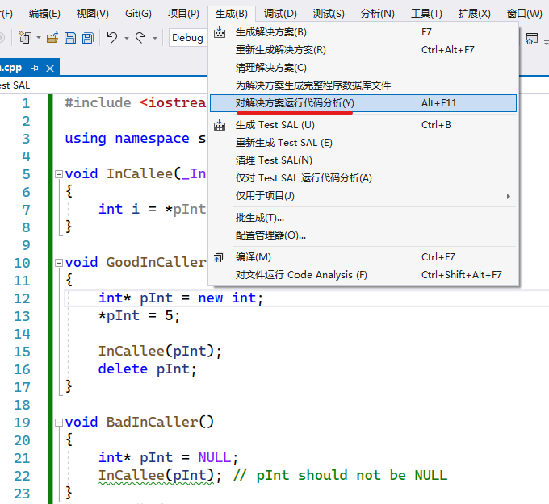
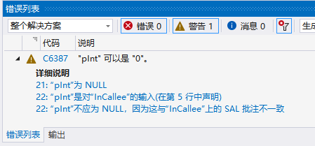

> [C/C++ 代码分析器 | Microsoft Docs](https://docs.microsoft.com/zh-cn/cpp/code-quality/?view=msvc-170)
>
> [最佳做法和示例 (SAL) | Microsoft Docs](https://docs.microsoft.com/zh-cn/cpp/code-quality/best-practices-and-examples-sal?view=msvc-170)

## 了解 SAL

SAL，Microsoft source code annotation language

Microsoft 源代码注释语言 (SAL) 提供一组描述函数如何使用其参数的注释，有关注释的假设以及完成注释时的保证。 注释是在头文件 `<sal.h>` 中定义的。 适用于 C++ 的 Visual Studio 代码分析使用 SAL 注释来修改其函数分析。

简而言之，SAL 是让编译器为你检查代码的一种低成本的方法。

## SAL 示例：`_In_` 批注

`_In_` 注释表明：

- 参数**必须有效**，并且**不会修改**。
- 函数仅会从**单元素缓冲区读取**。
- 调用方必须提供缓冲区并**对其进行初始化**。
- `_In_` 指定“**只读**”。 常见的错误是将 `_In_` 应用于应具有 `_Inout_` 注释的参数。
- 允许使用 `_In_`，但对于非指针标量，分析器将其忽略。

```cpp
void InCallee(_In_ int *pInt)
{
   int i = *pInt;
}

void GoodInCaller()
{
   int *pInt = new int;
   *pInt = 5;

   InCallee(pInt);
   delete pInt;
}

void BadInCaller()
{
   int *pInt = NULL;
   InCallee(pInt); // pInt should not be NULL
}
```

在菜单栏上，选择“生成”、“对解决方案运行代码分析”，对代码进行分析。



如果对此运行代码分析，将显示以下警告：



如果对此示例使用 Visual Studio Code Analysis，它将验证调用方是否将非空指针传递给 `pInt` 初始化的缓冲区。 在这种情况下，`pInt` 指针不能为 NULL。

## 示例: `_In_opt_` 批注

`_In_opt_` 与 `_In_` 相同，只不过允许输入参数为 NULL，因此，函数应检查该参数。

```cpp
void GoodInOptCallee(_In_opt_ int *pInt)
{
   if(pInt != NULL) {
      int i = *pInt;
   }
}

void BadInOptCallee(_In_opt_ int *pInt)
{
   int i = *pInt; // Dereferencing NULL pointer 'pInt'
}

void InOptCaller()
{
   int *pInt = NULL;
   GoodInOptCallee(pInt);
   BadInOptCallee(pInt);
}
```

Visual Studio Code Analysis 会验证函数在访问缓冲区之前是否检查 NULL。

## 其他批注简介

`_Out_` 支持一种常见方案，即传入一个指向元素缓冲区的非空指针，并由函数初始化该元素。 调用方不必在调用之前初始化缓冲区；调用的函数承诺在返回结果之前对缓冲区进行初始化。

```cpp
void GoodOutCallee(_Out_ int *pInt)
{
   *pInt = 5;
}

void BadOutCallee(_Out_ int *pInt)
{
   // Did not initialize pInt buffer before returning!
}

void OutCaller()
{
   int *pInt = new int;
   GoodOutCallee(pInt);
   BadOutCallee(pInt);
   delete pInt;
}
```

Visual Studio Code Analysis 工具验证调用方是否将非空指针传递给 `pInt` 缓冲区，以及函数是否在返回结果之前初始化该缓冲区。

`_Outptr_` 用于为预期返回指针的参数进行注释。 参数本身不应为 NULL，调用的函数将返回非空指针，且该指针指向已初始化的数据。

```cpp
void GoodOutPtrCallee(_Outptr_ int **pInt)
{
   int *pInt2 = new int;
   *pInt2 = 5;

   *pInt = pInt2;
}

void BadOutPtrCallee(_Outptr_ int **pInt)
{
   int *pInt2 = new int;
   // Did not initialize pInt buffer before returning!
   *pInt = pInt2;
}

void OutPtrCaller()
{
   int *pInt = NULL;
   GoodOutPtrCallee(&pInt);
   BadOutPtrCallee(&pInt);
}
```

Visual Studio Code Analysis 验证调用方是否为 `*pInt` 传递非空指针，以及函数是否在返回结果之前初始化缓冲区。

## SAL 最佳做法

SAL 是一种功能强大的技术，有助于提高代码的安全性和可靠性。 学习 SAL 后，你可以将新技能应用于日常工作。 在新的代码中，可以在整个设计过程中使用基于 SAL 的规范；在旧的代码中，可以增量添加注释，从而在每次更新时增加优势。

Microsoft 公用标头已经过注释。 因此，建议在项目中首先注释叶节点函数和调用 Win32 API 的函数，以获得最大益处。

## 何时批注?

下面是一些准则：

- 注释所有指针参数。
- 提供值范围注释，以便 Code Analysis 可以确保缓冲区和指针的安全。
- 注释锁定规则和锁定副作用。 有关详细信息，请参阅[注释锁定行为](https://docs.microsoft.com/zh-cn/cpp/code-quality/annotating-locking-behavior?view=msvc-170)。
- 注释驱动程序属性和其他特定于域的属性。

或者，可以注释所有参数，以在整个过程中清晰表明你的意图，并轻松检查是否已完成注释。