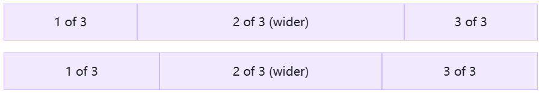
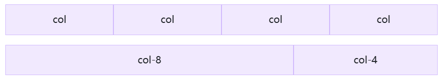
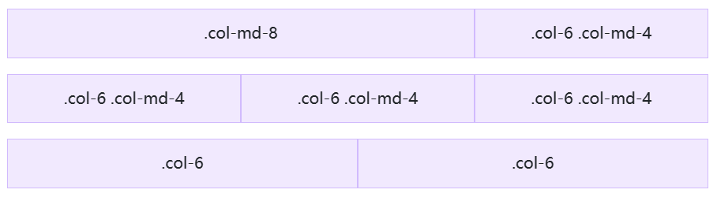

## Example 

Bootstrap’s grid system uses a series of containers, rows, and columns to layout and align content. It’s built with [flexbox](https://developer.mozilla.org/en-US/docs/Web/CSS/CSS_Flexible_Box_Layout/Basic_Concepts_of_Flexbox) and is fully responsive. Below is an example and an in-depth explanation for how the grid system comes together.


```html
<div class="container text-center">
  <div class="row">
    <div class="col">
      Column
    </div>
    <div class="col">
      Column
    </div>
    <div class="col">
      Column
    </div>
  </div>
</div>
```

The above example creates three equal-width columns across all devices and viewports using our predefined grid classes. Those columns are centered in the page with the parent `.container`.

## How it works 

Breaking it down, here’s how the grid system comes together:

- **Our grid supports [six responsive breakpoints](https://getbootstrap.com/docs/5.2/layout/breakpoints/).** Breakpoints are based on `min-width` media queries, meaning they affect that breakpoint and all those above it (e.g., `.col-sm-4` applies to `sm`, `md`, `lg`, `xl`, and `xxl`). This means you can control container and column sizing and behavior by each breakpoint.
- **Containers center and horizontally pad your content.** Use `.container` for a responsive pixel width, `.container-fluid` for `width: 100%` across all viewports and devices, or a responsive container (e.g., `.container-md`) for a combination of fluid and pixel widths.
- **Rows are wrappers for columns.** Each column has horizontal `padding` (called a gutter) for controlling the space between them. This `padding` is then counteracted on the rows with negative margins to ensure the content in your columns is visually aligned down the left side. Rows also support modifier classes to [uniformly apply column sizing](https://getbootstrap.com/docs/5.2/layout/grid/#row-columns) and [gutter classes](https://getbootstrap.com/docs/5.2/layout/gutters/) to change the spacing of your content.
- **Columns are incredibly flexible.** There are 12 template columns available per row, allowing you to create different combinations of elements that span any number of columns. Column classes indicate the number of template columns to span (e.g., `col-4` spans four). `width`s are set in percentages so you always have the same relative sizing.
- **Gutters are also responsive and customizable.** [Gutter classes are available](https://getbootstrap.com/docs/5.2/layout/gutters/) across all breakpoints, with all the same sizes as our [margin and padding spacing](https://getbootstrap.com/docs/5.2/utilities/spacing/). Change horizontal gutters with `.gx-*` classes, vertical gutters with `.gy-*`, or all gutters with `.g-*` classes. `.g-0` is also available to remove gutters.
- **Sass variables, maps, and mixins power the grid.** If you don’t want to use the predefined grid classes in Bootstrap, you can use our [grid’s source Sass](https://getbootstrap.com/docs/5.2/layout/grid/#sass) to create your own with more semantic markup. We also include some CSS custom properties to consume these Sass variables for even greater flexibility for you.

## Grid options 

Bootstrap’s grid system can adapt across all six default breakpoints, and any breakpoints you customize. The six default grid tiers are as follows:

- Extra small (xs)
- Small (sm)
- Medium (md)
- Large (lg)
- Extra large (xl)
- Extra extra large (xxl)

As noted above, each of these breakpoints have their own container, unique class prefix, and modifiers. Here’s how the grid changes across these breakpoints:

|                       | xs <576px                                                    | sm ≥576px  | md ≥768px  | lg ≥992px  | xl ≥1200px | xxl ≥1400px |
| --------------------- | ------------------------------------------------------------ | ---------- | ---------- | ---------- | ---------- | ----------- |
| Container `max-width` | None (auto)                                                  | 540px      | 720px      | 960px      | 1140px     | 1320px      |
| Class prefix          | `.col-`                                                      | `.col-sm-` | `.col-md-` | `.col-lg-` | `.col-xl-` | `.col-xxl-` |
| # of columns          | 12                                                           |            |            |            |            |             |
| Gutter width          | 1.5rem (.75rem on left and right)                            |            |            |            |            |             |
| Custom gutters        | [Yes](https://getbootstrap.com/docs/5.2/layout/gutters/)     |            |            |            |            |             |
| Nestable              | [Yes](https://getbootstrap.com/docs/5.2/layout/grid/#nesting) |            |            |            |            |             |
| Column ordering       | [Yes](https://getbootstrap.com/docs/5.2/layout/columns/#reordering) |            |            |            |            |             |

## Auto-layout columns

Utilize breakpoint-specific column classes for easy column sizing without an explicit numbered class like `.col-sm-6`.

### Equal-width

For example, here are two grid layouts that apply to every device and viewport, from `xs` to `xxl`. Add any number of unit-less classes for each breakpoint you need and every column will be the same width.


```html
<div class="container text-center">
  <div class="row">
    <div class="col">
      1 of 2
    </div>
    <div class="col">
      2 of 2
    </div>
  </div>
  <div class="row">
    <div class="col">
      1 of 3
    </div>
    <div class="col">
      2 of 3
    </div>
    <div class="col">
      3 of 3
    </div>
  </div>
</div>
```

### Setting one column width 

Auto-layout for flexbox grid columns also means you can set the width of one column and have the sibling columns automatically resize around it. You may use predefined grid classes (as shown below), grid mixins, or inline widths. Note that the other columns will resize no matter the width of the center column.



```html
<div class="container text-center">
  <div class="row">
    <div class="col">
      1 of 3
    </div>
    <div class="col-6">
      2 of 3 (wider)
    </div>
    <div class="col">
      3 of 3
    </div>
  </div>
  <div class="row">
    <div class="col">
      1 of 3
    </div>
    <div class="col-5">
      2 of 3 (wider)
    </div>
    <div class="col">
      3 of 3
    </div>
  </div>
</div>
```

### Variable width content 

Use `col-{breakpoint}-auto` classes to size columns based on the natural width of their content.


```html
<div class="container text-center">
  <div class="row justify-content-md-center">
    <div class="col col-lg-2">
      1 of 3
    </div>
    <div class="col-md-auto">
      Variable width content
    </div>
    <div class="col col-lg-2">
      3 of 3
    </div>
  </div>
  <div class="row">
    <div class="col">
      1 of 3
    </div>
    <div class="col-md-auto">
      Variable width content
    </div>
    <div class="col col-lg-2">
      3 of 3
    </div>
  </div>
</div>
```

## Responsive classes 

Bootstrap’s grid includes six tiers of predefined classes for building complex responsive layouts. Customize the size of your columns on extra small, small, medium, large, or extra large devices however you see fit.

### All breakpoints 

For grids that are the same from the smallest of devices to the largest, use the `.col` and `.col-*` classes. Specify a numbered class when you need a particularly sized column; otherwise, feel free to stick to `.col`.



```html
<div class="container text-center">
  <div class="row">
    <div class="col">col</div>
    <div class="col">col</div>
    <div class="col">col</div>
    <div class="col">col</div>
  </div>
  <div class="row">
    <div class="col-8">col-8</div>
    <div class="col-4">col-4</div>
  </div>
</div>
```

### Stacked to horizontal 

Using a single set of `.col-sm-*` classes, you can create a basic grid system that starts out stacked and becomes horizontal at the small breakpoint (`sm`).


```html
<div class="container text-center">
  <div class="row">
    <div class="col-sm-8">col-sm-8</div>
    <div class="col-sm-4">col-sm-4</div>
  </div>
  <div class="row">
    <div class="col-sm">col-sm</div>
    <div class="col-sm">col-sm</div>
    <div class="col-sm">col-sm</div>
  </div>
</div>
```

### Mix and match 

Don’t want your columns to simply stack in some grid tiers? Use a combination of different classes for each tier as needed. See the example below for a better idea of how it all works.



```html
<div class="container text-center">
  <!-- Stack the columns on mobile by making one full-width and the other half-width -->
  <div class="row">
    <div class="col-md-8">.col-md-8</div>
    <div class="col-6 col-md-4">.col-6 .col-md-4</div>
  </div>

  <!-- Columns start at 50% wide on mobile and bump up to 33.3% wide on desktop -->
  <div class="row">
    <div class="col-6 col-md-4">.col-6 .col-md-4</div>
    <div class="col-6 col-md-4">.col-6 .col-md-4</div>
    <div class="col-6 col-md-4">.col-6 .col-md-4</div>
  </div>

  <!-- Columns are always 50% wide, on mobile and desktop -->
  <div class="row">
    <div class="col-6">.col-6</div>
    <div class="col-6">.col-6</div>
  </div>
</div>
```

### Row columns 

Use the responsive `.row-cols-*` classes to quickly set the number of columns that best render your content and layout. Whereas normal `.col-*` classes apply to the individual columns (e.g., `.col-md-4`), the row columns classes are set on the parent `.row` as a shortcut. With `.row-cols-auto` you can give the columns their natural width.

Use these row columns classes to quickly create basic grid layouts or to control your card layouts.


```html
<div class="container text-center">
  <div class="row row-cols-2">
    <div class="col">Column</div>
    <div class="col">Column</div>
    <div class="col">Column</div>
    <div class="col">Column</div>
  </div>
</div>
```


```html
<div class="container text-center">
  <div class="row row-cols-3">
    <div class="col">Column</div>
    <div class="col">Column</div>
    <div class="col">Column</div>
    <div class="col">Column</div>
  </div>
</div>
```


```html
<div class="container text-center">
  <div class="row row-cols-auto">
    <div class="col">Column</div>
    <div class="col">Column</div>
    <div class="col">Column</div>
    <div class="col">Column</div>
  </div>
</div>
```


```html
<div class="container text-center">
  <div class="row row-cols-4">
    <div class="col">Column</div>
    <div class="col">Column</div>
    <div class="col-6">Column</div>
    <div class="col">Column</div>
  </div>
</div>
```


```html
<div class="container text-center">
  <div class="row row-cols-1 row-cols-sm-2 row-cols-md-4">
    <div class="col">Column</div>
    <div class="col">Column</div>
    <div class="col">Column</div>
    <div class="col">Column</div>
  </div>
</div>
```