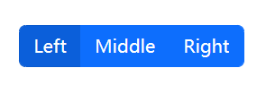
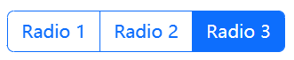
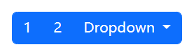
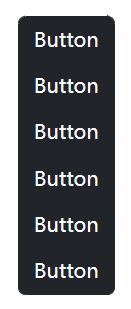

Group a series of buttons together on a single line or stack them in a vertical column.

## Basic example

Wrap a series of buttons with `.btn` in `.btn-group`.



```html
<div class="btn-group" role="group" aria-label="Basic example">
  <button type="button" class="btn btn-primary">Left</button>
  <button type="button" class="btn btn-primary">Middle</button>
  <button type="button" class="btn btn-primary">Right</button>
</div>
```

These classes can also be added to groups of links, as an alternative to the [`.nav` navigation components](https://getbootstrap.com/docs/5.2/components/navs-tabs/).


```html
<div class="btn-group">
  <a href="#" class="btn btn-primary active" aria-current="page">Active link</a>
  <a href="#" class="btn btn-primary">Link</a>
  <a href="#" class="btn btn-primary">Link</a>
</div>
```

## Checkbox and radio button groups

Combine button-like checkbox and radio [toggle buttons](https://getbootstrap.com/docs/5.2/forms/checks-radios/) into a seamless looking button group.


```html
<div class="btn-group" role="group" aria-label="Basic checkbox toggle button group">
  <input type="checkbox" class="btn-check" id="btncheck1" autocomplete="off">
  <label class="btn btn-outline-primary" for="btncheck1">Checkbox 1</label>

  <input type="checkbox" class="btn-check" id="btncheck2" autocomplete="off">
  <label class="btn btn-outline-primary" for="btncheck2">Checkbox 2</label>

  <input type="checkbox" class="btn-check" id="btncheck3" autocomplete="off">
  <label class="btn btn-outline-primary" for="btncheck3">Checkbox 3</label>
```



```html
<div class="btn-group" role="group" aria-label="Basic radio toggle button group">
  <input type="radio" class="btn-check" name="btnradio" id="btnradio1" autocomplete="off" checked>
  <label class="btn btn-outline-primary" for="btnradio1">Radio 1</label>

  <input type="radio" class="btn-check" name="btnradio" id="btnradio2" autocomplete="off">
  <label class="btn btn-outline-primary" for="btnradio2">Radio 2</label>

  <input type="radio" class="btn-check" name="btnradio" id="btnradio3" autocomplete="off">
  <label class="btn btn-outline-primary" for="btnradio3">Radio 3</label>
</div>
```

## Nesting

Place a `.btn-group` within another `.btn-group` when you want dropdown menus mixed with a series of buttons.



```html
<div class="btn-group" role="group" aria-label="Button group with nested dropdown">
  <button type="button" class="btn btn-primary">1</button>
  <button type="button" class="btn btn-primary">2</button>

  <div class="btn-group" role="group">
    <button type="button" class="btn btn-primary dropdown-toggle" data-bs-toggle="dropdown" aria-expanded="false">
      Dropdown
    </button>
    <ul class="dropdown-menu">
      <li><a class="dropdown-item" href="#">Dropdown link</a></li>
      <li><a class="dropdown-item" href="#">Dropdown link</a></li>
    </ul>
  </div>
</div>
```

## Vertical variation 

Make a set of buttons appear vertically stacked rather than horizontally. **Split button dropdowns are not supported here.**



```html
<div class="btn-group-vertical" role="group" aria-label="Vertical button group">
  <button type="button" class="btn btn-dark">Button</button>
  <button type="button" class="btn btn-dark">Button</button>
  <button type="button" class="btn btn-dark">Button</button>
  <button type="button" class="btn btn-dark">Button</button>
  <button type="button" class="btn btn-dark">Button</button>
  <button type="button" class="btn btn-dark">Button</button>
</div>
```

