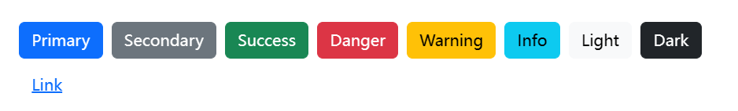
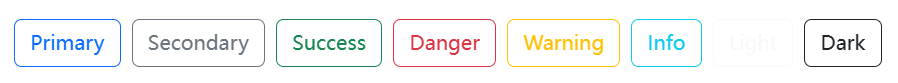

Use Bootstrap’s custom button styles for actions in forms, dialogs, and more with support for multiple sizes, states, and more.

## Examples

Bootstrap includes several predefined button styles, each serving its own semantic purpose, with a few extras thrown in for more control.



```html
<button type="button" class="btn btn-primary">Primary</button>
<button type="button" class="btn btn-secondary">Secondary</button>
<button type="button" class="btn btn-success">Success</button>
<button type="button" class="btn btn-danger">Danger</button>
<button type="button" class="btn btn-warning">Warning</button>
<button type="button" class="btn btn-info">Info</button>
<button type="button" class="btn btn-light">Light</button>
<button type="button" class="btn btn-dark">Dark</button>

<button type="button" class="btn btn-link">Link</button>
```

## Outline button

In need of a button, but not the hefty background colors they bring? Replace the default modifier classes with the `.btn-outline-*` ones to remove all background images and colors on any button.



```html
<button type="button" class="btn btn-outline-primary">Primary</button>
<button type="button" class="btn btn-outline-secondary">Secondary</button>
<button type="button" class="btn btn-outline-success">Success</button>
<button type="button" class="btn btn-outline-danger">Danger</button>
<button type="button" class="btn btn-outline-warning">Warning</button>
<button type="button" class="btn btn-outline-info">Info</button>
<button type="button" class="btn btn-outline-light">Light</button>
<button type="button" class="btn btn-outline-dark">Dark</button>
```

