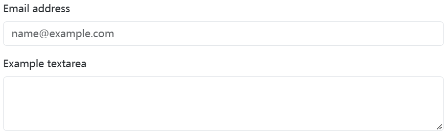
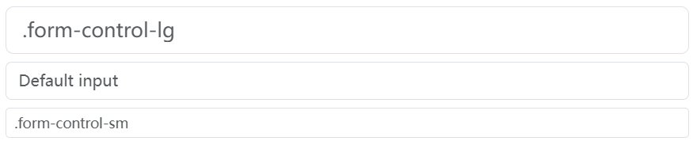
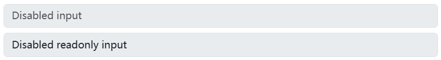
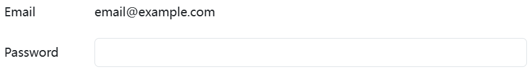
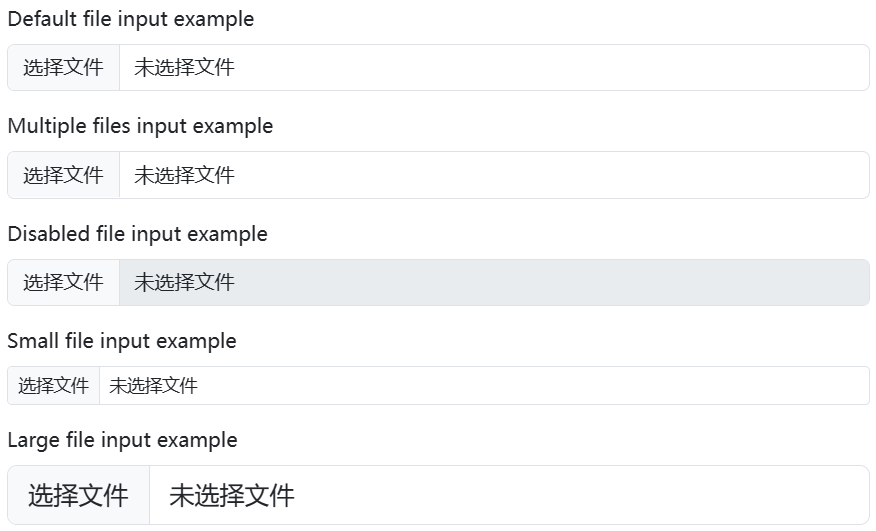
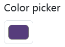
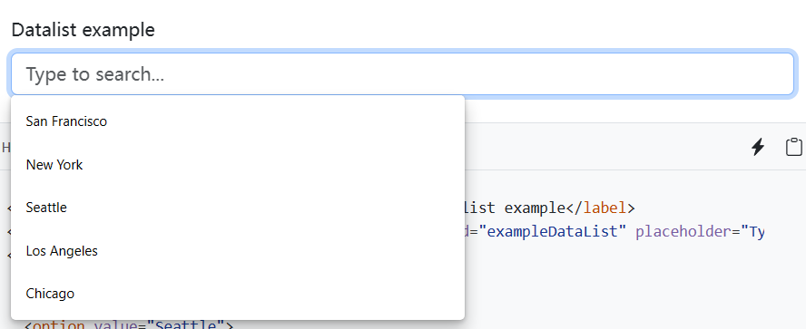

Give textual form controls like `<input>`s and `<textarea>`s an upgrade with custom styles, sizing, focus states, and more.

## Example 

Form controls are styled with a mix of Sass and CSS variables, allowing them to adapt to color modes and support any customization method.



```html
<div class="mb-3">
  <label for="exampleFormControlInput1" class="form-label">Email address</label>
  <input type="email" class="form-control" id="exampleFormControlInput1" placeholder="name@example.com">
</div>
<div class="mb-3">
  <label for="exampleFormControlTextarea1" class="form-label">Example textarea</label>
  <textarea class="form-control" id="exampleFormControlTextarea1" rows="3"></textarea>
</div>
```

## Sizing 

Set heights using classes like `.form-control-lg` and `.form-control-sm`.



```html
<input class="form-control form-control-lg" type="text" placeholder=".form-control-lg" aria-label=".form-control-lg example">
<input class="form-control" type="text" placeholder="Default input" aria-label="default input example">
<input class="form-control form-control-sm" type="text" placeholder=".form-control-sm" aria-label=".form-control-sm example">
```

## Disabled 

Add the `disabled` boolean attribute on an input to give it a grayed out appearance, remove pointer events, and prevent focusing.



```html
<input class="form-control" type="text" placeholder="Disabled input" aria-label="Disabled input example" disabled>
<input class="form-control" type="text" value="Disabled readonly input" aria-label="Disabled input example" disabled readonly>
```

## Readonly 

Add the `readonly` boolean attribute on an input to prevent modification of the input’s value. `readonly` inputs can still be focused and selected, while `disabled` inputs cannot.


```html
<input class="form-control" type="text" value="Readonly input here..." aria-label="readonly input example" readonly>
```

## Readonly plain text 

If you want to have `<input readonly>` elements in your form styled as plain text, replace `.form-control` with `.form-control-plaintext` to remove the default form field styling and preserve the correct `margin` and `padding`.



```html
  <div class="mb-3 row">
    <label for="staticEmail" class="col-sm-2 col-form-label">Email</label>
    <div class="col-sm-10">
      <input type="text" readonly class="form-control-plaintext" id="staticEmail" value="email@example.com">
    </div>
  </div>
  <div class="mb-3 row">
    <label for="inputPassword" class="col-sm-2 col-form-label">Password</label>
    <div class="col-sm-10">
      <input type="password" class="form-control" id="inputPassword">
    </div>
  </div>
```

## File input



```html
<div class="mb-3">
  <label for="formFile" class="form-label">Default file input example</label>
  <input class="form-control" type="file" id="formFile">
</div>
<div class="mb-3">
  <label for="formFileMultiple" class="form-label">Multiple files input example</label>
  <input class="form-control" type="file" id="formFileMultiple" multiple>
</div>
<div class="mb-3">
  <label for="formFileDisabled" class="form-label">Disabled file input example</label>
  <input class="form-control" type="file" id="formFileDisabled" disabled>
</div>
<div class="mb-3">
  <label for="formFileSm" class="form-label">Small file input example</label>
  <input class="form-control form-control-sm" id="formFileSm" type="file">
</div>
<div>
  <label for="formFileLg" class="form-label">Large file input example</label>
  <input class="form-control form-control-lg" id="formFileLg" type="file">
</div>
```

## Color 

Set the `type="color"` and add `.form-control-color` to the `<input>`. We use the modifier class to set fixed `height`s and override some inconsistencies between browsers.



```html
<label for="exampleColorInput" class="form-label">Color picker</label>
<input type="color" class="form-control form-control-color" id="exampleColorInput" value="#563d7c" title="Choose your color">
```

## Datalists 

Datalists allow you to create a group of `<option>`s that can be accessed (and autocompleted) from within an `<input>`. These are similar to `<select>` elements, but come with more menu styling limitations and differences. While most browsers and operating systems include some support for `<datalist>` elements, their styling is inconsistent at best.

Learn more about [support for datalist elements](https://caniuse.com/datalist).



```html
<label for="exampleDataList" class="form-label">Datalist example</label>
<input class="form-control" list="datalistOptions" id="exampleDataList" placeholder="Type to search...">
<datalist id="datalistOptions">
  <option value="San Francisco">
  <option value="New York">
  <option value="Seattle">
  <option value="Los Angeles">
  <option value="Chicago">
</datalist>
```