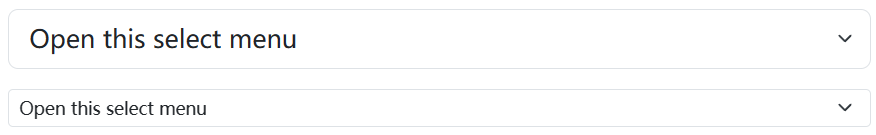
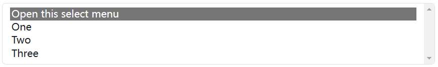
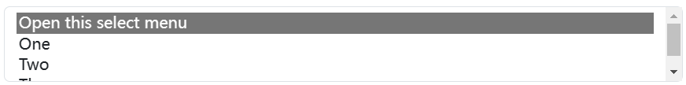
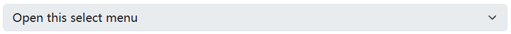

## Default 

Custom `<select>` menus need only a custom class, `.form-select` to trigger the custom styles. Custom styles are limited to the `<select>`’s initial appearance and cannot modify the `<option>`s due to browser limitations.


```html
<select class="form-select" aria-label="Default select example">
  <option selected>Open this select menu</option>
  <option value="1">One</option>
  <option value="2">Two</option>
  <option value="3">Three</option>
</select>
```

## Sizing 

You may also choose from small and large custom selects to match our similarly sized text inputs.



```html
<select class="form-select form-select-lg mb-3" aria-label=".form-select-lg example">
  <option selected>Open this select menu</option>
  <option value="1">One</option>
  <option value="2">Two</option>
  <option value="3">Three</option>
</select>

<select class="form-select form-select-sm" aria-label=".form-select-sm example">
  <option selected>Open this select menu</option>
  <option value="1">One</option>
  <option value="2">Two</option>
  <option value="3">Three</option>
</select>
```

The `multiple` attribute is also supported:



```html
<select class="form-select" multiple aria-label="multiple select example">
  <option selected>Open this select menu</option>
  <option value="1">One</option>
  <option value="2">Two</option>
  <option value="3">Three</option>
</select>
```

As is the `size` attribute:



```html
<select class="form-select" size="3" aria-label="size 3 select example">
  <option selected>Open this select menu</option>
  <option value="1">One</option>
  <option value="2">Two</option>
  <option value="3">Three</option>
</select>
```

## Disabled 

Add the `disabled` boolean attribute on a select to give it a grayed out appearance and remove pointer events.



```html
<select class="form-select" aria-label="Disabled select example" disabled>
  <option selected>Open this select menu</option>
  <option value="1">One</option>
  <option value="2">Two</option>
  <option value="3">Three</option>
</select>
```