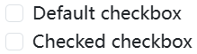
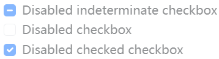
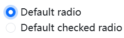
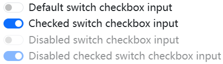
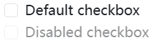
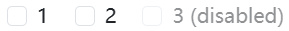
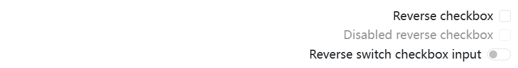
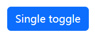
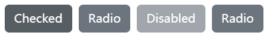
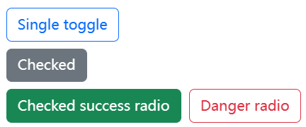

## Approach 

Browser default checkboxes and radios are replaced with the help of `.form-check`, a series of classes for both input types that improves the layout and behavior of their HTML elements, that provide greater customization and cross browser consistency. Checkboxes are for selecting one or several options in a list, while radios are for selecting one option from many.

Structurally, our `<input>`s and `<label>`s are sibling elements as opposed to an `<input>` within a `<label>`. This is slightly more verbose as you must specify `id` and `for` attributes to relate the `<input>` and `<label>`. We use the sibling selector (`~`) for all our `<input>` states, like `:checked` or `:disabled`. When combined with the `.form-check-label` class, we can easily style the text for each item based on the `<input>`’s state.

Our checks use custom Bootstrap icons to indicate checked or indeterminate states.

## Checks



```html
<div class="form-check">
  <input class="form-check-input" type="checkbox" value="" id="flexCheckDefault">
  <label class="form-check-label" for="flexCheckDefault">
    Default checkbox
  </label>
</div>
<div class="form-check">
  <input class="form-check-input" type="checkbox" value="" id="flexCheckChecked" checked>
  <label class="form-check-label" for="flexCheckChecked">
    Checked checkbox
  </label>
</div>
```

### Indeterminate 

Checkboxes can utilize the `:indeterminate` pseudo class when manually set via JavaScript (there is no available HTML attribute for specifying it).


```html
<div class="form-check">
  <input class="form-check-input" type="checkbox" value="" id="flexCheckIndeterminate">
  <label class="form-check-label" for="flexCheckIndeterminate">
    Indeterminate checkbox
  </label>
</div>
```

### Disabled 

Add the `disabled` attribute and the associated `<label>`s are automatically styled to match with a lighter color to help indicate the input’s state.



```html
<div class="form-check">
  <input class="form-check-input" type="checkbox" value="" id="flexCheckIndeterminateDisabled" disabled>
  <label class="form-check-label" for="flexCheckIndeterminateDisabled">
    Disabled indeterminate checkbox
  </label>
</div>
<div class="form-check">
  <input class="form-check-input" type="checkbox" value="" id="flexCheckDisabled" disabled>
  <label class="form-check-label" for="flexCheckDisabled">
    Disabled checkbox
  </label>
</div>
<div class="form-check">
  <input class="form-check-input" type="checkbox" value="" id="flexCheckCheckedDisabled" checked disabled>
  <label class="form-check-label" for="flexCheckCheckedDisabled">
    Disabled checked checkbox
  </label>
</div>
```

## Radios



```html
<div class="form-check">
  <input class="form-check-input" type="radio" name="flexRadioDefault" id="flexRadioDefault1">
  <label class="form-check-label" for="flexRadioDefault1">
    Default radio
  </label>
</div>
<div class="form-check">
  <input class="form-check-input" type="radio" name="flexRadioDefault" id="flexRadioDefault2" checked>
  <label class="form-check-label" for="flexRadioDefault2">
    Default checked radio
  </label>
</div>
```

## Switches 

A switch has the markup of a custom checkbox but uses the `.form-switch` class to render a toggle switch. Consider using `role="switch"` to more accurately convey the nature of the control to assistive technologies that support this role. In older assistive technologies, it will simply be announced as a regular checkbox as a fallback. Switches also support the `disabled` attribute.



```html
<div class="form-check form-switch">
  <input class="form-check-input" type="checkbox" role="switch" id="flexSwitchCheckDefault">
  <label class="form-check-label" for="flexSwitchCheckDefault">Default switch checkbox input</label>
</div>
<div class="form-check form-switch">
  <input class="form-check-input" type="checkbox" role="switch" id="flexSwitchCheckChecked" checked>
  <label class="form-check-label" for="flexSwitchCheckChecked">Checked switch checkbox input</label>
</div>
<div class="form-check form-switch">
  <input class="form-check-input" type="checkbox" role="switch" id="flexSwitchCheckDisabled" disabled>
  <label class="form-check-label" for="flexSwitchCheckDisabled">Disabled switch checkbox input</label>
</div>
<div class="form-check form-switch">
  <input class="form-check-input" type="checkbox" role="switch" id="flexSwitchCheckCheckedDisabled" checked disabled>
  <label class="form-check-label" for="flexSwitchCheckCheckedDisabled">Disabled checked switch checkbox input</label>
</div>
```

## Default (stacked) 

By default, any number of checkboxes and radios that are immediate sibling will be vertically stacked and appropriately spaced with `.form-check`.



```html
<div class="form-check">
  <input class="form-check-input" type="checkbox" value="" id="defaultCheck1">
  <label class="form-check-label" for="defaultCheck1">
    Default checkbox
  </label>
</div>
<div class="form-check">
  <input class="form-check-input" type="checkbox" value="" id="defaultCheck2" disabled>
  <label class="form-check-label" for="defaultCheck2">
    Disabled checkbox
  </label>
</div>
```

## Inline

Group checkboxes or radios on the same horizontal row by adding `.form-check-inline` to any `.form-check`.



```html
<div class="form-check form-check-inline">
  <input class="form-check-input" type="checkbox" id="inlineCheckbox1" value="option1">
  <label class="form-check-label" for="inlineCheckbox1">1</label>
</div>
<div class="form-check form-check-inline">
  <input class="form-check-input" type="checkbox" id="inlineCheckbox2" value="option2">
  <label class="form-check-label" for="inlineCheckbox2">2</label>
</div>
<div class="form-check form-check-inline">
  <input class="form-check-input" type="checkbox" id="inlineCheckbox3" value="option3" disabled>
  <label class="form-check-label" for="inlineCheckbox3">3 (disabled)</label>
</div>
```

## Reverse 

Put your checkboxes, radios, and switches on the opposite side with the `.form-check-reverse` modifier class.



```html
<div class="form-check form-check-reverse">
  <input class="form-check-input" type="checkbox" value="" id="reverseCheck1">
  <label class="form-check-label" for="reverseCheck1">
    Reverse checkbox
  </label>
</div>
<div class="form-check form-check-reverse">
  <input class="form-check-input" type="checkbox" value="" id="reverseCheck2" disabled>
  <label class="form-check-label" for="reverseCheck2">
    Disabled reverse checkbox
  </label>
</div>

<div class="form-check form-switch form-check-reverse">
  <input class="form-check-input" type="checkbox" id="flexSwitchCheckReverse">
  <label class="form-check-label" for="flexSwitchCheckReverse">Reverse switch checkbox input</label>
</div>
```

## Toggle buttons 

Create button-like checkboxes and radio buttons by using `.btn` styles rather than `.form-check-label` on the `<label>` elements. These toggle buttons can further be grouped in a [button group](https://getbootstrap.com/docs/5.3/components/button-group/) if needed.

### Checkbox toggle buttons



```html
<input type="checkbox" class="btn-check" id="btn-check" autocomplete="off">
<label class="btn btn-primary" for="btn-check">Single toggle</label>
```

### Radio toggle buttons



```html
<input type="radio" class="btn-check" name="options" id="option1" autocomplete="off" checked>
<label class="btn btn-secondary" for="option1">Checked</label>

<input type="radio" class="btn-check" name="options" id="option2" autocomplete="off">
<label class="btn btn-secondary" for="option2">Radio</label>

<input type="radio" class="btn-check" name="options" id="option3" autocomplete="off" disabled>
<label class="btn btn-secondary" for="option3">Disabled</label>

<input type="radio" class="btn-check" name="options" id="option4" autocomplete="off">
<label class="btn btn-secondary" for="option4">Radio</label>
```

### Outlined styles 

Different variants of `.btn`, such at the various outlined styles, are supported.



```html
<input type="checkbox" class="btn-check" id="btn-check-outlined" autocomplete="off">
<label class="btn btn-outline-primary" for="btn-check-outlined">Single toggle</label><br>

<input type="checkbox" class="btn-check" id="btn-check-2-outlined" checked autocomplete="off">
<label class="btn btn-outline-secondary" for="btn-check-2-outlined">Checked</label><br>

<input type="radio" class="btn-check" name="options-outlined" id="success-outlined" autocomplete="off" checked>
<label class="btn btn-outline-success" for="success-outlined">Checked success radio</label>

<input type="radio" class="btn-check" name="options-outlined" id="danger-outlined" autocomplete="off">
<label class="btn btn-outline-danger" for="danger-outlined">Danger radio</label>
```