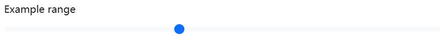
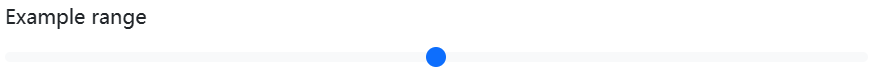

## Overview 

Create custom `<input type="range">` controls with `.form-range`. The track (the background) and thumb (the value) are both styled to appear the same across browsers. As only Firefox supports “filling” their track from the left or right of the thumb as a means to visually indicate progress, we do not currently support it.


```html
<label for="customRange1" class="form-label">Example range</label>
<input type="range" class="form-range" id="customRange1">
```

## Min and max 

Range inputs have implicit values for `min` and `max`—`0` and `100`, respectively. You may specify new values for those using the `min` and `max` attributes.



```html
<label for="customRange2" class="form-label">Example range</label>
<input type="range" class="form-range" min="0" max="5" id="customRange2">
```

## Steps 

By default, range inputs “snap” to integer values. To change this, you can specify a `step` value. In the example below, we double the number of steps by using `step="0.5"`.



```html
<label for="customRange3" class="form-label">Example range</label>
<input type="range" class="form-range" min="0" max="5" step="0.5" id="customRange3">
```