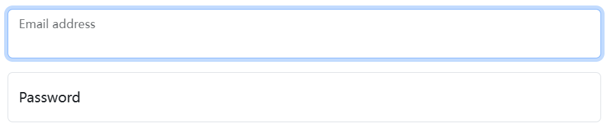
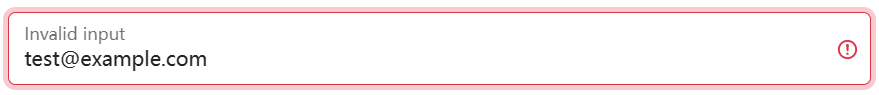
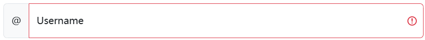

## Example 

Wrap a pair of `<input class="form-control">` and `<label>` elements in `.form-floating` to enable floating labels with Bootstrap’s textual form fields. A `placeholder` is required on each `<input>` as our method of CSS-only floating labels uses the `:placeholder-shown` pseudo-element. Also note that the `<input>` must come first so we can utilize a sibling selector (e.g., `~`).



```html
<div class="form-floating mb-3">
  <input type="email" class="form-control" id="floatingInput" placeholder="name@example.com">
  <label for="floatingInput">Email address</label>
</div>
<div class="form-floating">
  <input type="password" class="form-control" id="floatingPassword" placeholder="Password">
  <label for="floatingPassword">Password</label>
</div>
```

When there’s a `value` already defined, `<label>`s will automatically adjust to their floated position.


```html
<form class="form-floating">
  <input type="email" class="form-control" id="floatingInputValue" placeholder="name@example.com" value="test@example.com">
  <label for="floatingInputValue">Input with value</label>
</form>
```

Form validation styles also work as expected.



```html
<form class="form-floating">
  <input type="email" class="form-control is-invalid" id="floatingInputInvalid" placeholder="name@example.com" value="test@example.com">
  <label for="floatingInputInvalid">Invalid input</label>
</form>
```

## Textareas 

By default, `<textarea>`s with `.form-control` will be the same height as `<input>`s.


```html
<div class="form-floating">
  <textarea class="form-control" placeholder="Leave a comment here" id="floatingTextarea"></textarea>
  <label for="floatingTextarea">Comments</label>
</div>
```

To set a custom height on your `<textarea>`, do not use the `rows` attribute. Instead, set an explicit `height` (either inline or via custom CSS).


```html
<div class="form-floating">
  <textarea class="form-control" placeholder="Leave a comment here" id="floatingTextarea2" style="height: 100px"></textarea>
  <label for="floatingTextarea2">Comments</label>
</div>
```

## Selects 

Other than `.form-control`, floating labels are only available on `.form-select`s. They work in the same way, but unlike `<input>`s, they’ll always show the `<label>` in its floated state. **Selects with `size` and `multiple` are not supported.**


```html
<div class="form-floating">
  <select class="form-select" id="floatingSelect" aria-label="Floating label select example">
    <option selected>Open this select menu</option>
    <option value="1">One</option>
    <option value="2">Two</option>
    <option value="3">Three</option>
  </select>
  <label for="floatingSelect">Works with selects</label>
</div>
```

## Readonly plaintext 

Floating labels also support `.form-control-plaintext`, which can be helpful for toggling from an editable `<input>` to a plaintext value without affecting the page layout.


```html
<div class="form-floating mb-3">
  <input type="email" readonly class="form-control-plaintext" id="floatingEmptyPlaintextInput" placeholder="name@example.com">
  <label for="floatingEmptyPlaintextInput">Empty input</label>
</div>
<div class="form-floating mb-3">
  <input type="email" readonly class="form-control-plaintext" id="floatingPlaintextInput" placeholder="name@example.com" value="name@example.com">
  <label for="floatingPlaintextInput">Input with value</label>
</div>
```

## Input groups 

Floating labels also support `.input-group`.


```html
<div class="input-group mb-3">
  <span class="input-group-text">@</span>
  <div class="form-floating">
    <input type="text" class="form-control" id="floatingInputGroup1" placeholder="Username">
    <label for="floatingInputGroup1">Username</label>
  </div>
</div>
```

When using `.input-group` and `.form-floating` along with form validation, the `-feedback` should be placed outside of the `.form-floating`, but inside of the `.input-group`. This means that the feedback will need to be shown using javascript.



```html
<div class="input-group has-validation">
  <span class="input-group-text">@</span>
  <div class="form-floating is-invalid">
    <input type="text" class="form-control is-invalid" id="floatingInputGroup2" placeholder="Username" required>
    <label for="floatingInputGroup2">Username</label>
  </div>
  <div class="invalid-feedback">
    Please choose a username.
  </div>
</div>
```

## Layout 

When working with the Bootstrap grid system, be sure to place form elements within column classes.


```html
<div class="row g-2">
  <div class="col-md">
    <div class="form-floating">
      <input type="email" class="form-control" id="floatingInputGrid" placeholder="name@example.com" value="mdo@example.com">
      <label for="floatingInputGrid">Email address</label>
    </div>
  </div>
  <div class="col-md">
    <div class="form-floating">
      <select class="form-select" id="floatingSelectGrid">
        <option selected>Open this select menu</option>
        <option value="1">One</option>
        <option value="2">Two</option>
        <option value="3">Three</option>
      </select>
      <label for="floatingSelectGrid">Works with selects</label>
    </div>
  </div>
</div>
```