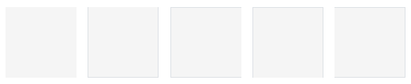
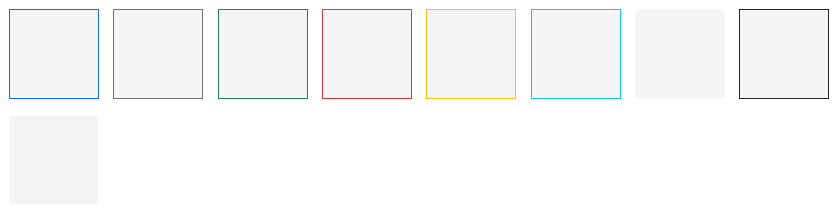
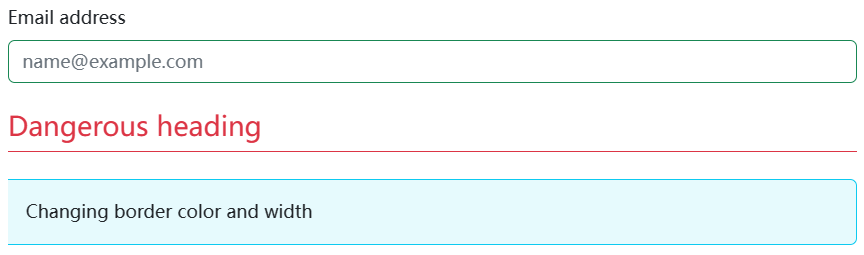
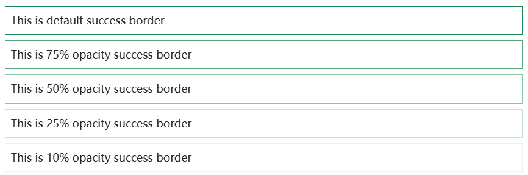
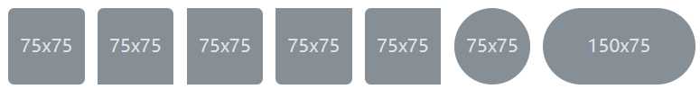
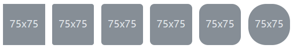

Use border utilities to quickly style the border and border-radius of an element. Great for images, buttons, or any other element.

## Additive 

Add borders to custom elements:


```html
<span class="border"></span>
<span class="border-top"></span>
<span class="border-end"></span>
<span class="border-bottom"></span>
<span class="border-start"></span>
```

### Subtractive

Or remove borders:



```html
<span class="border border-0"></span>
<span class="border border-top-0"></span>
<span class="border border-end-0"></span>
<span class="border border-bottom-0"></span>
<span class="border border-start-0"></span>
```

## Color

Change the border color using utilities built on our theme colors.



```html
<span class="border border-primary"></span>
<span class="border border-secondary"></span>
<span class="border border-success"></span>
<span class="border border-danger"></span>
<span class="border border-warning"></span>
<span class="border border-info"></span>
<span class="border border-light"></span>
<span class="border border-dark"></span>
<span class="border border-white"></span>
```

Or modify the default `border-color` of a component:



```html
<div class="mb-4">
  <label for="exampleFormControlInput1" class="form-label">Email address</label>
  <input type="email" class="form-control border-success" id="exampleFormControlInput1" placeholder="name@example.com">
</div>

<div class="h4 pb-2 mb-4 text-danger border-bottom border-danger">
  Dangerous heading
</div>

<div class="p-3 bg-info bg-opacity-10 border border-info border-start-0 rounded-end">
  Changing border color and width
</div>
```

## Opacity 



```html
<div class="border border-success p-2 mb-2">This is default success border</div>
<div class="border border-success p-2 mb-2 border-opacity-75">This is 75% opacity success border</div>
<div class="border border-success p-2 mb-2 border-opacity-50">This is 50% opacity success border</div>
<div class="border border-success p-2 mb-2 border-opacity-25">This is 25% opacity success border</div>
<div class="border border-success p-2 border-opacity-10">This is 10% opacity success border</div>
```

## Width


```html
<span class="border border-1"></span>
<span class="border border-2"></span>
<span class="border border-3"></span>
<span class="border border-4"></span>
<span class="border border-5"></span>
```

## Radius

Add classes to an element to easily round its corners.



```html


```

### Sizes

Use the scaling classes for larger or smaller rounded corners. Sizes range from `0` to `5`, and can be configured by modifying the utilities API.



```html


```