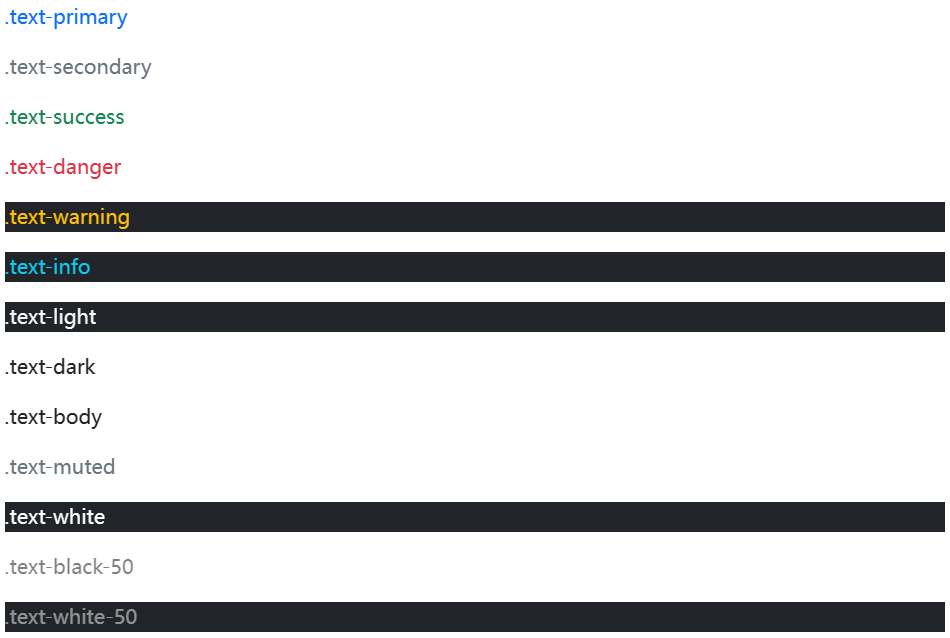
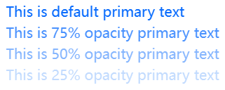

Convey meaning through `color` with a handful of color utility classes. Includes support for styling links with hover states, too.

## Colors 

Colorize text with color utilities. If you want to colorize links, you can use the [`.link-*` helper classes](https://getbootstrap.com/docs/5.2/helpers/colored-links/) which have `:hover` and `:focus` states.



```html
<p class="text-primary">.text-primary</p>
<p class="text-secondary">.text-secondary</p>
<p class="text-success">.text-success</p>
<p class="text-danger">.text-danger</p>
<p class="text-warning bg-dark">.text-warning</p>
<p class="text-info bg-dark">.text-info</p>
<p class="text-light bg-dark">.text-light</p>
<p class="text-dark">.text-dark</p>
<p class="text-body">.text-body</p>
<p class="text-muted">.text-muted</p>
<p class="text-white bg-dark">.text-white</p>
<p class="text-black-50">.text-black-50</p>
<p class="text-white-50 bg-dark">.text-white-50</p>
```

> **Deprecation:** With the addition of `.text-opacity-*` utilities and CSS variables for text utilities, `.text-black-50` and `.text-white-50` are deprecated as of v5.1.0. They’ll be removed in v6.0.0.

## Opacity 

As of v5.1.0, text color utilities are generated with Sass using CSS variables. This allows for real-time color changes without compilation and dynamic alpha transparency changes.



```html
<div class="text-primary">This is default primary text</div>
<div class="text-primary text-opacity-75">This is 75% opacity primary text</div>
<div class="text-primary text-opacity-50">This is 50% opacity primary text</div>
<div class="text-primary text-opacity-25">This is 25% opacity primary text</div>
```