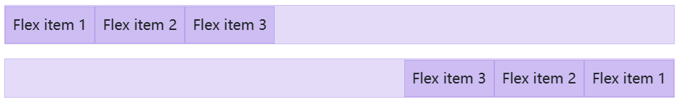
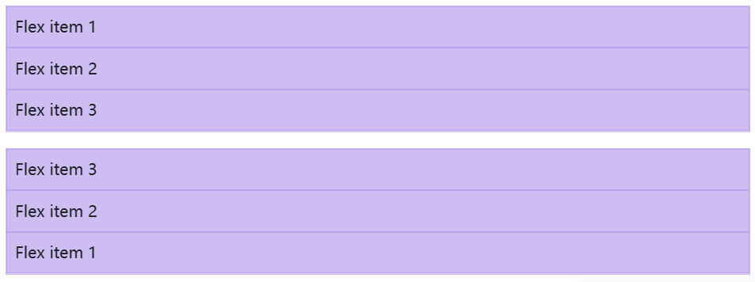
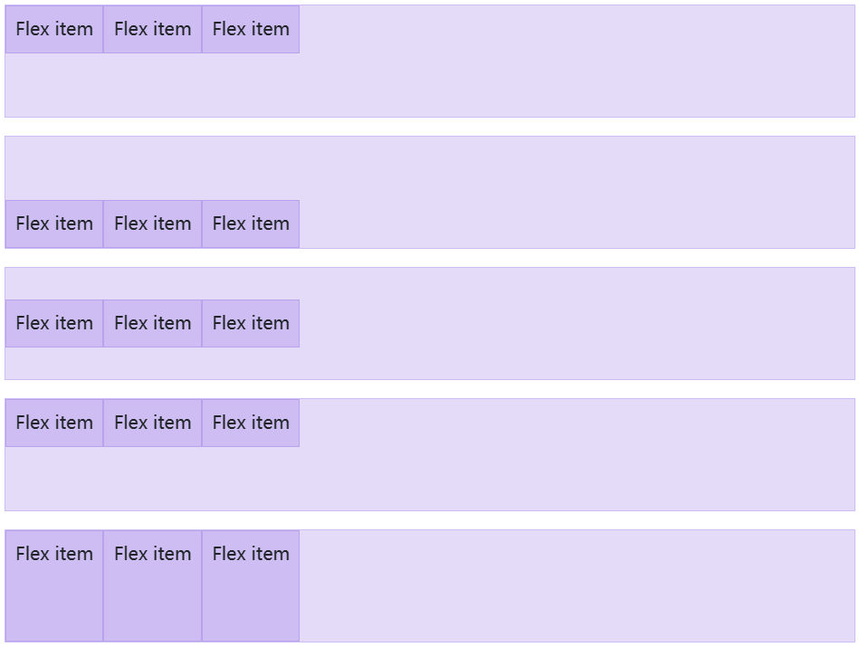
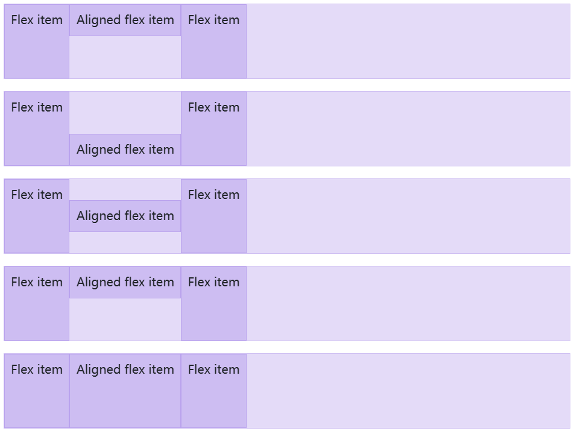
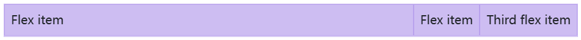
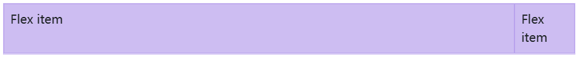
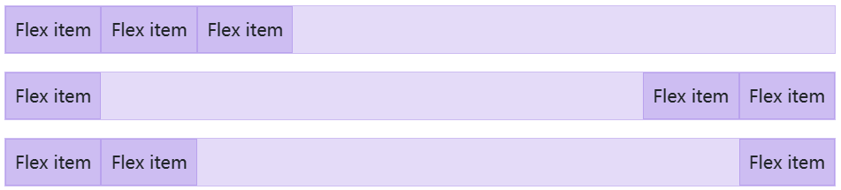

Quickly manage the layout, alignment, and sizing of grid columns, navigation, components, and more with a full suite of responsive flexbox utilities. For more complex implementations, custom CSS may be necessary.

## Enable flex behaviors 

Apply `display` utilities to create a flexbox container and transform **direct children elements** into flex items. Flex containers and items are able to be modified further with additional flex properties.


```html
<div class="d-flex p-2">I'm a flexbox container!</div>
```


```html
<div class="d-inline-flex p-2">I'm an inline flexbox container!</div>
```

## Direction

Set the direction of flex items in a flex container with direction utilities. In most cases you can omit the horizontal class here as the browser default is `row`. However, you may encounter situations where you needed to explicitly set this value (like responsive layouts).

Use `.flex-row` to set a horizontal direction (the browser default), or `.flex-row-reverse` to start the horizontal direction from the opposite side.



```html
<div class="d-flex flex-row mb-3">
  <div class="p-2">Flex item 1</div>
  <div class="p-2">Flex item 2</div>
  <div class="p-2">Flex item 3</div>
</div>
<div class="d-flex flex-row-reverse">
  <div class="p-2">Flex item 1</div>
  <div class="p-2">Flex item 2</div>
  <div class="p-2">Flex item 3</div>
</div>
```

Use `.flex-column` to set a vertical direction, or `.flex-column-reverse` to start the vertical direction from the opposite side.



```html
<div class="d-flex flex-column mb-3">
  <div class="p-2">Flex item 1</div>
  <div class="p-2">Flex item 2</div>
  <div class="p-2">Flex item 3</div>
</div>
<div class="d-flex flex-column-reverse">
  <div class="p-2">Flex item 1</div>
  <div class="p-2">Flex item 2</div>
  <div class="p-2">Flex item 3</div>
</div>
```

## Justify content 

Use `justify-content` utilities on flexbox containers to change the alignment of flex items on the main axis (the x-axis to start, y-axis if `flex-direction: column`). Choose from `start` (browser default), `end`, `center`, `between`, `around`, or `evenly`.


```html
<div class="d-flex justify-content-start">...</div>
<div class="d-flex justify-content-end">...</div>
<div class="d-flex justify-content-center">...</div>
<div class="d-flex justify-content-between">...</div>
<div class="d-flex justify-content-around">...</div>
<div class="d-flex justify-content-evenly">...</div>
```

## Align items

Use `align-items` utilities on flexbox containers to change the alignment of flex items on the cross axis (the y-axis to start, x-axis if `flex-direction: column`). Choose from `start`, `end`, `center`, `baseline`, or `stretch` (browser default).



```html
<div class="d-flex align-items-start">...</div>
<div class="d-flex align-items-end">...</div>
<div class="d-flex align-items-center">...</div>
<div class="d-flex align-items-baseline">...</div>
<div class="d-flex align-items-stretch">...</div>
```

## Align self 

Use `align-self` utilities on flexbox items to individually change their alignment on the cross axis (the y-axis to start, x-axis if `flex-direction: column`). Choose from the same options as `align-items`: `start`, `end`, `center`, `baseline`, or `stretch` (browser default).



```html
<div class="align-self-start">Aligned flex item</div>
<div class="align-self-end">Aligned flex item</div>
<div class="align-self-center">Aligned flex item</div>
<div class="align-self-baseline">Aligned flex item</div>
<div class="align-self-stretch">Aligned flex item</div>
```

## Fill

Use the `.flex-fill` class on a series of sibling elements to force them into widths equal to their content (or equal widths if their content does not surpass their border-boxes) while taking up all available horizontal space.


```html
<div class="d-flex">
  <div class="p-2 flex-fill">Flex item with a lot of content</div>
  <div class="p-2 flex-fill">Flex item</div>
  <div class="p-2 flex-fill">Flex item</div>
</div>
```

## Grow and shrink

Use `.flex-grow-*` utilities to toggle a flex item’s ability to grow to fill available space. In the example below, the `.flex-grow-1` elements uses all available space it can, while allowing the remaining two flex items their necessary space.



```html
<div class="d-flex">
  <div class="p-2 flex-grow-1">Flex item</div>
  <div class="p-2">Flex item</div>
  <div class="p-2">Third flex item</div>
</div>
```

Use `.flex-shrink-*` utilities to toggle a flex item’s ability to shrink if necessary. In the example below, the second flex item with `.flex-shrink-1` is forced to wrap its contents to a new line, “shrinking” to allow more space for the previous flex item with `.w-100`.



```html
<div class="d-flex">
  <div class="p-2 w-100">Flex item</div>
  <div class="p-2 flex-shrink-1">Flex item</div>
</div>
```

## Auto margins 

Flexbox can do some pretty awesome things when you mix flex alignments with auto margins. Shown below are three examples of controlling flex items via auto margins: default (no auto margin), pushing two items to the right (`.me-auto`), and pushing two items to the left (`.ms-auto`).



```html
<div class="d-flex mb-3">
  <div class="p-2">Flex item</div>
  <div class="p-2">Flex item</div>
  <div class="p-2">Flex item</div>
</div>

<div class="d-flex mb-3">
  <div class="me-auto p-2">Flex item</div>
  <div class="p-2">Flex item</div>
  <div class="p-2">Flex item</div>
</div>

<div class="d-flex mb-3">
  <div class="p-2">Flex item</div>
  <div class="p-2">Flex item</div>
  <div class="ms-auto p-2">Flex item</div>
</div>
```

## Wrap 

Change how flex items wrap in a flex container. Choose from no wrapping at all (the browser default) with `.flex-nowrap`, wrapping with `.flex-wrap`, or reverse wrapping with `.flex-wrap-reverse`.

```html
<div class="d-flex flex-nowrap">
  ...
</div>
```

```html
<div class="d-flex flex-wrap">
  ...
</div>
```

```html
<div class="d-flex flex-wrap-reverse">
  ...
</div>
```

## Order 

Change the *visual* order of specific flex items with a handful of `order` utilities. We only provide options for making an item first or last, as well as a reset to use the DOM order. As `order` takes any integer value from 0 to 5, add custom CSS for any additional values needed.

```html
<div class="d-flex flex-nowrap">
  <div class="order-3 p-2">First flex item</div>
  <div class="order-2 p-2">Second flex item</div>
  <div class="order-1 p-2">Third flex item</div>
</div>
```