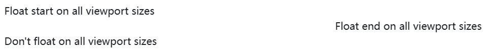

Toggle floats on any element, across any breakpoint, using our responsive float utilities.

## Overview

These utility classes float an element to the left or right, or disable floating, based on the current viewport size using the [CSS `float` property](https://developer.mozilla.org/en-US/docs/Web/CSS/float). `!important` is included to avoid specificity issues. These use the same viewport breakpoints as our grid system. Please be aware float utilities have no effect on flex items.



```html
<div class="float-start">Float start on all viewport sizes</div><br>
<div class="float-end">Float end on all viewport sizes</div><br>
<div class="float-none">Don't float on all viewport sizes</div>
```