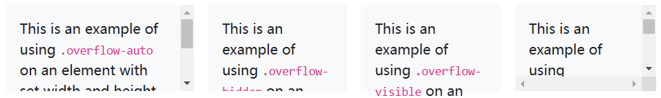

Use these shorthand utilities for quickly configuring how content overflows an element.

Adjust the `overflow` property on the fly with four default values and classes. These classes are not responsive by default.



```html
<div class="overflow-auto">...</div>
<div class="overflow-hidden">...</div>
<div class="overflow-visible">...</div>
<div class="overflow-scroll">...</div>
```

