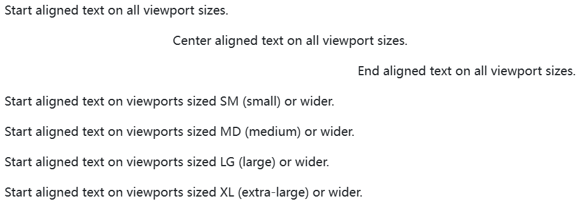
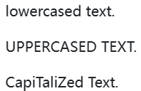
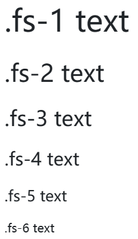
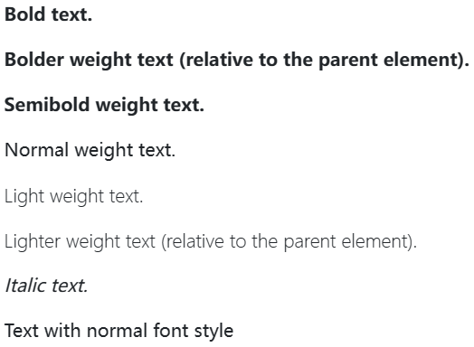
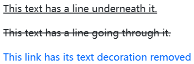

Documentation and examples for common text utilities to control alignment, wrapping, weight, and more.

## Text alignment 

Easily realign text to components with text alignment classes. For start, end, and center alignment, responsive classes are available that use the same viewport width breakpoints as the grid system.



```html
<p class="text-start">Start aligned text on all viewport sizes.</p>
<p class="text-center">Center aligned text on all viewport sizes.</p>
<p class="text-end">End aligned text on all viewport sizes.</p>

<p class="text-sm-start">Start aligned text on viewports sized SM (small) or wider.</p>
<p class="text-md-start">Start aligned text on viewports sized MD (medium) or wider.</p>
<p class="text-lg-start">Start aligned text on viewports sized LG (large) or wider.</p>
<p class="text-xl-start">Start aligned text on viewports sized XL (extra-large) or wider.</p>
```

## Text wrapping and overflow

Wrap text with a `.text-wrap` class.

This text should wrap.


```html
<div class="badge bg-primary text-wrap" style="width: 6rem;">
  This text should wrap.
</div>
```

Prevent text from wrapping with a `.text-nowrap` class.


```html
<div class="text-nowrap bg-light border" style="width: 8rem;">
  This text should overflow the parent.
</div>
```

## Word break

Prevent long strings of text from breaking your components’ layout by using `.text-break` to set `word-wrap: break-word` and `word-break: break-word`. We use `word-wrap` instead of the more common `overflow-wrap` for wider browser support, and add the deprecated `word-break: break-word` to avoid issues with flex containers.

```html
<p class="textbreak">
    mmmmmmmmmmmmmmmmmmmmmmmmmmmmmmmmmmmmmmmmmmmmmmmmmmmmmmmmmmmmmmmmmmmmmmmmmmmmmmmmmmmmmmmmmmmmmmmmmmmm
</p>
```

## Text transform

Transform text in components with text capitalization classes.



```html
<p class="text-lowercase">Lowercased text.</p>
<p class="text-uppercase">Uppercased text.</p>
<p class="text-capitalize">CapiTaliZed text.</p>
```

Note how `.text-capitalize` only changes the first letter of each word, leaving the case of any other letters unaffected.

## Font size 

Quickly change the `font-size` of text. While our heading classes (e.g., `.h1`–`.h6`) apply `font-size`, `font-weight`, and `line-height`, these utilities *only* apply `font-size`. Sizing for these utilities matches HTML’s heading elements, so as the number increases, their size decreases.



```html
<p class="fs-1">.fs-1 text</p>
<p class="fs-2">.fs-2 text</p>
<p class="fs-3">.fs-3 text</p>
<p class="fs-4">.fs-4 text</p>
<p class="fs-5">.fs-5 text</p>
<p class="fs-6">.fs-6 text</p>
```

## Font weight and italics 

Quickly change the `font-weight` or `font-style` of text with these utilities. `font-style` utilities are abbreviated as `.fst-*` and `font-weight` utilities are abbreviated as `.fw-*`.



```html
<p class="fw-bold">Bold text.</p>
<p class="fw-bolder">Bolder weight text (relative to the parent element).</p>
<p class="fw-semibold">Semibold weight text.</p>
<p class="fw-normal">Normal weight text.</p>
<p class="fw-light">Light weight text.</p>
<p class="fw-lighter">Lighter weight text (relative to the parent element).</p>
<p class="fst-italic">Italic text.</p>
<p class="fst-normal">Text with normal font style</p>
```

## Line height 

Change the line height with `.lh-*` utilities.

```html
<p class="lh-1">This is a long paragraph written to show how the line-height of an element is affected by our utilities. Classes are applied to the element itself or sometimes the parent element. These classes can be customized as needed with our utility API.</p>
<p class="lh-sm">This is a long paragraph written to show how the line-height of an element is affected by our utilities. Classes are applied to the element itself or sometimes the parent element. These classes can be customized as needed with our utility API.</p>
<p class="lh-base">This is a long paragraph written to show how the line-height of an element is affected by our utilities. Classes are applied to the element itself or sometimes the parent element. These classes can be customized as needed with our utility API.</p>
<p class="lh-lg">This is a long paragraph written to show how the line-height of an element is affected by our utilities. Classes are applied to the element itself or sometimes the parent element. These classes can be customized as needed with our utility API.</p>
```

## Monospace 

Change a selection to our monospace font stack with `.font-monospace`.

```html
<p class="font-monospace">This is in monospace</p>
```

## Reset color 

Reset a text or link’s color with `.text-reset`, so that it inherits the color from its parent.

```html
<p class="text-muted">
  Muted text with a <a href="#" class="text-reset">reset link</a>.
</p>
```

## Text decoration 

Decorate text in components with text decoration classes.



```html
<p class="text-decoration-underline">This text has a line underneath it.</p>
<p class="text-decoration-line-through">This text has a line going through it.</p>
<a href="#" class="text-decoration-none">This link has its text decoration removed</a>
```