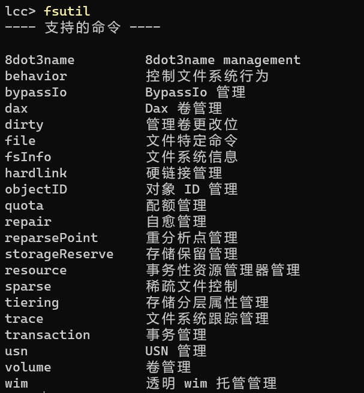
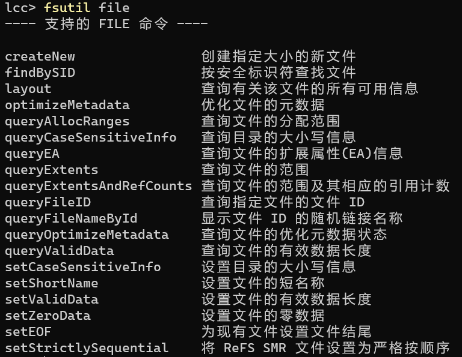

在日常的测试过程中，特别是涉及到存储容量，我们可能需要指定大小的文件。下面对在windows下创建指定大小的文件进行简单介绍：

使用 **fsutil** 命名，可在cmd窗口查看 **fsutil** 支持的命令，如图

 由此可知，我们可通过**fsutil file createnew** 命令来新建指定大小的文件

**用法**： **fsutil file createnew** 文件名 文件大小

如: fsutil file createnew D:\test.txt 1024 

在D盘创建一个test.txt的文件，文件大小为1KB