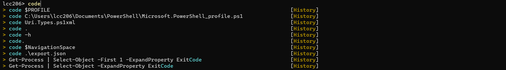

参考 cmdlet：[Set-PSReadLineOption (PSReadLine) - PowerShell | Microsoft Docs](https://docs.microsoft.com/en-us/powershell/module/psreadline/set-psreadlineoption?view=powershell-7.2)

效果如图所示，通过上下键切换命令，可以按 F2 键切换为 **InlineView** 模式。




打开 PowerShell，在命令行里输入：

```powershell
# notepad
notepad $PROFILE
# vscode
code $PROFILE
```

打开文本编辑器，在 PowerShell 的配置文件中添加以下设置命令：

```powershell
Set-PSReadlineOption -PredictionSource History
Set-PSReadLineOption -PredictionViewStyle ListView
```

第一行命令通过 `PredictionSource` 参数将指定 PSReadLine 预测命令来源。

第二行命令通过 `PredictionViewStyle` 参数将预测视图指定为列表模式。

关闭 PowerShell 并再次打开，输入命令即可观察变化，就如同上图那样看到预测的命令。

## 指定 Azure Predictor 作为智能感知命令来源

还可以指定其他的来源来进行命令感知提示，比如 Azure，在此之前，你需要将预测来源改为 **HistoryAndPlugin**，这样就可以通过其他插件来提供命令提示。

```powershell
Set-PSReadlineOption -PredictionSource HistoryAndPlugin
```

具体的步骤请参考微软的官方文档：https://docs.microsoft.com/zh-cn/powershell/azure/az-predictor