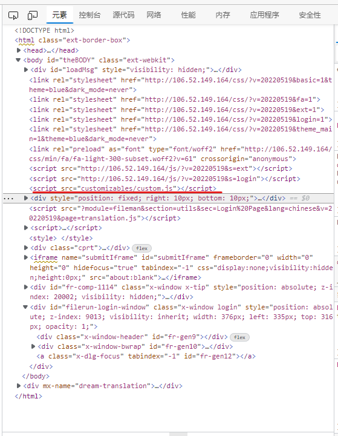

# FileRun 配置

搭建环境为：使用 NGINX 在 Ubuntu 20 上安装 File Run，部署在腾讯云上

安装教程文章：[How to install FileRun on Ubuntu 20 with NGINX](http://blog.filerun.com/how-to-install-filerun-on-ubuntu-20-with-nginx/)

## PHP-fpm fileRun 文件配置

> 注意：可以在此处找到最新的 File Run 推荐 PHP 设置：https://docs.filerun.com/php_configuration

编辑配置文件

```
sudo vim /etc/php/7.4/fpm/conf.d/filerun.ini  
```

以下是我自己的文件配置，我将 `upload_max_filesize` 和 `post_max_size` 修改为了 100M

```
expose_php              = Off  
error_reporting         = E_ALL & ~E_NOTICE  
display_errors          = Off  
display_startup_errors  = Off  
log_errors              = On  
ignore_repeated_errors  = Off  
allow_url_fopen         = On  
allow_url_include       = Off  
variables_order         = "GPCS"  
allow_webdav_methods    = On  
memory_limit            = 128M  
max_execution_time      = 300  
output_buffering        = Off  
output_handler          = ""  
zlib.output_compression = Off  
zlib.output_handler     = ""  
safe_mode               = Off  
register_globals        = Off  
magic_quotes_gpc        = Off  
upload_max_filesize     = 100M  
post_max_size           = 100M  
enable_dl               = Off  
disable_functions       = ""  
disable_classes         = ""  
session.save_handler     = files  
session.use_cookies      = 1  
session.use_only_cookies = 1  
session.auto_start       = 0  
session.cookie_lifetime  = 0  
session.cookie_httponly  = 1  
date.timezone            = "UTC"
```

重启 PHP-FPM

```
sudo systemctl restart php7.4-fpm  
```

没有的话要设置自启动

```
sudo systemctl enable php7.4-fpm  
```

## 为 PHP 配置 NGINX

FileRun 创建了一个全新的服务器块，位置是 `/etc/nginx/conf.d/default.conf  ` 

这是我的配置文件，添加了 SSL 访问端口来开启 https，同时设置了证书文件和私钥文件的位置，文件来自于腾讯云 SSL 证书，配置也是参考了腾讯云文档的配置

配置中有几行被注释了，主要是因为会有 PHP 远程代码执行漏洞，参考[公告-腾讯云 (tencent.com)](https://cloud.tencent.com/announce/detail/823)，暂不清楚这么做会对 FileRun 运行产生什么影响

```
server {  
  listen 80;
  listen [::]:80;
  server_name _;
  root /var/www/html/;
  index index.php index.html;

  location / {
    try_files $uri $uri/ /index.php;
  }

  location ~ [^/]\.php(/|$) {
  #  fastcgi_split_path_info ^(.+?\.php)(/.*)$;
    if (!-f $document_root$fastcgi_script_name) {
        return 404;
    }


    include fastcgi_params;
    include snippets/fastcgi-php.conf;

    fastcgi_param SCRIPT_FILENAME $document_root$fastcgi_script_name;
 #   fastcgi_param PATH_INFO $fastcgi_path_info;
    fastcgi_pass unix:/run/php/php7.4-fpm.sock;
  }

 # A long browser cache lifetime can speed up repeat visits to your page
  location ~* \.(jpg|jpeg|gif|png|webp|svg|woff|woff2|ttf|css|js|ico|xml)$ {
       access_log        off;
       log_not_found     off;
       expires           360d;
  }

  # disable access to hidden files
  location ~ /\.ht {
      access_log off;
      log_not_found off;
      deny all;
  }
}

server {
  #SSL 默认访问端口号为 443
  listen 443 ssl; 
  listen [::]:443;
  root /var/www/html/;
  index index.php index.html;
  #请填写绑定证书的域名
  server_name lccspace.cn; 
  #请填写证书文件的相对路径或绝对路径
  ssl_certificate /etc/nginx/conf.d/lccspace.cn_bundle.crt; 
  #请填写私钥文件的相对路径或绝对路径
  ssl_certificate_key /etc/nginx/conf.d/lccspace.cn.key; 
  ssl_session_timeout 5m;
  #请按照以下协议配置
  ssl_protocols TLSv1.2 TLSv1.3; 
  #请按照以下套件配置，配置加密套件，写法遵循 openssl 标准。
  ssl_ciphers ECDHE-RSA-AES128-GCM-SHA256:HIGH:!aNULL:!MD5:!RC4:!DHE; 
  ssl_prefer_server_ciphers on;
        
  location / {
    try_files $uri $uri/ /index.php;
  }

  location ~ [^/]\.php(/|$) {
  #  fastcgi_split_path_info ^(.+?\.php)(/.*)$;
    if (!-f $document_root$fastcgi_script_name) {
        return 404;
    }


    include fastcgi_params;
    include snippets/fastcgi-php.conf;

    fastcgi_param SCRIPT_FILENAME $document_root$fastcgi_script_name;
 #   fastcgi_param PATH_INFO $fastcgi_path_info;
    fastcgi_pass unix:/run/php/php7.4-fpm.sock;
  }

 # A long browser cache lifetime can speed up repeat visits to your page
  location ~* \.(jpg|jpeg|gif|png|webp|svg|woff|woff2|ttf|css|js|ico|xml)$ {
       access_log        off;
       log_not_found     off;
       expires           360d;
  }

  # disable access to hidden files
  location ~ /\.ht {
      access_log off;
      log_not_found off;
      deny all;
  }      
}
```

当更改 nginx 配置后，检查配置文件是否正确

```
sudo nginx -t  
```

如果没有报错，重载 nginx 配置

```command
sudo systemctl reload nginx  
```

## NGINX 上传文件大小限制更改

如果nginx上传文件超出默认大小限制，会提示：413 Request Entity Too Large

修改文件 /etc/nginx/nginx.conf，更改 `client_max_body_size` 的大小，我设置的是 100m。

```
user www-data;
worker_processes auto;
pid /run/nginx.pid;
include /etc/nginx/modules-enabled/*.conf;

events {
	worker_connections 768;
	# multi_accept on;
}

http {
	client_max_body_size 100m;

	##
	# Basic Settings
	##

	sendfile on;
	tcp_nopush on;
	tcp_nodelay on;
	keepalive_timeout 65;
	types_hash_max_size 2048;
	# server_tokens off;

	# server_names_hash_bucket_size 64;
	# server_name_in_redirect off;

	include /etc/nginx/mime.types;
	default_type application/octet-stream;

	##
	# SSL Settings
	##

	ssl_protocols TLSv1 TLSv1.1 TLSv1.2 TLSv1.3; # Dropping SSLv3, ref: POODLE
	ssl_prefer_server_ciphers on;

	##
	# Logging Settings
	##

	access_log /var/log/nginx/access.log;
	error_log /var/log/nginx/error.log;

	##
	# Gzip Settings
	##

	gzip on;

	# gzip_vary on;
	# gzip_proxied any;
	# gzip_comp_level 6;
	# gzip_buffers 16 8k;
	# gzip_http_version 1.1;
	# gzip_types text/plain text/css application/json application/javascript text/xml application/xml application/xml+rss text/javascript;

	##
	# Virtual Host Configs
	##

	include /etc/nginx/conf.d/*.conf;
	include /etc/nginx/sites-enabled/*;
}


#mail {
#	# See sample authentication script at:
#	# http://wiki.nginx.org/ImapAuthenticateWithApachePhpScript
# 
#	# auth_http localhost/auth.php;
#	# pop3_capabilities "TOP" "USER";
#	# imap_capabilities "IMAP4rev1" "UIDPLUS";
# 
#	server {
#		listen     localhost:110;
#		protocol   pop3;
#		proxy      on;
#	}
# 
#	server {
#		listen     localhost:143;
#		protocol   imap;
#		proxy      on;
#	}
#}
```

## FileRun 添加自定义 JS 代码块

参考 [advanced_configuration :: FileRun Documentation](https://docs.filerun.com/advanced_configuration#user_interface)

找到 FileRun 安装的路径的 customizables 文件夹，如果这个文件夹里没有 config.php 文件的话，那就创建它，我的文件路径为 `/var/www/html/customizables/config.php`。

更改 config.php 文件：

```php
<?php
$config['app']['ui']['custom_js_url'] = 'customizables/custom.js';
?>
```

当然了，你还需要创建一个 custom.js 文件，需要注意的是，路径的上下文为 `/var/www/html/`

这样就可以在 FileRun 的网页上添加 JS 代码了，添加的具体位置为：


