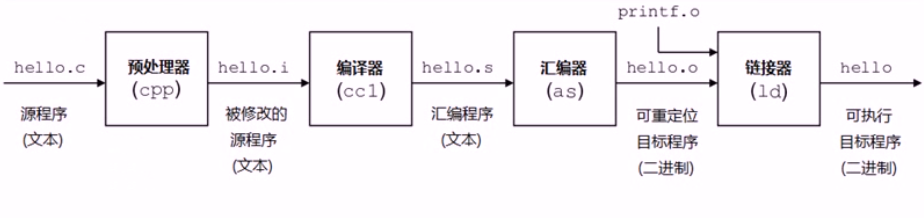

## 什么是gcc

gcc的全称是GNU Compiler Collection，它是一个能够编译多种语言的编译器。最开始gcc是作为C语言的编译器（GNU C Compiler），现在除了c语言，还支持C++、java、Pascal等语言。gcc支持多种硬件平台。


## gcc的特点

- gcc是一个可移植的编译器，支持多种硬件平台。例如ARM、X86等等。
- gcc不仅是个本地编译器，它还能跨平台交叉编译。所谓的本地编译器，是指编译出来的程序只能够在本地环境进行运行。而gcc编译出来的程序能够在其他平台进行运行。例如嵌入式程序可在x86上编译，然后在arm上运行。
- gcc有多种语言前端，用于解析不同的语言。
- gcc是按模块化设计的，可以加入新语言和新CPU架构的支持。
- gcc是自由软件。任何人都可以使用或更改这个软件。


## gcc编译程序的过程

gcc编译程序主要经过四个过程：

- 预处理（Pre-Processing）
- 编译 （Compiling）
- 汇编 （Assembling）
- 链接 （Linking）



预处理实际上是将头文件、宏进行展开。

编译阶段，gcc调用不同语言的编译器，例如c语言调用编译器ccl。gcc实际上是个工具链，在编译程序的过程中调用不同的工具。

汇编阶段，gcc调用汇编器进行汇编。链接过程会将程序所需要的目标文件进行链接成可执行文件。

汇编器生成的是可重定位的目标文件，学过操作系统，我们知道，在源程序中地址是从0开始的，这是一个相对地址，而程序真正在内存中运行时的地址肯定不是从0开始的，而且在编写源代码的时候也不能知道程序的绝对地址，所以**重定位**能够将源代码的代码、变量等定位为内存具体地址。下面以一张图来表示这个过程，注意过程中文件的后缀变化，编译选项和这些后缀有关。


## gcc常用选项

| 选项名 | 作用                                                         |
| ------ | ------------------------------------------------------------ |
| -o     | 产生目标（.i、.s、.o、可执行文件等）                         |
| -E     | 只运行C预编译器                                              |
| -S     | 告诉编译器产生汇编程序文件后停止编译，产生的汇编语言文件拓展名为.s |
| -c     | 通知gcc取消连接步骤，即编译源码，并在最后生成目标文件        |
| -Wall  | 使gcc对源文件的代码有问题的地方发出警告                      |
| -Idir  | 将dir目录加入搜索头文件的目录路径                            |
| -Ldir  | 将dir目录加入搜索库的目录路径                                |
| -llib  | 连接lib库                                                    |
| -g     | 在目标文件中嵌入调试信息，以便gdb之类的调试程序调试          |

现在我们有源文件hello.c，下面是一些gcc的使用示例：

```cpp
gcc -E hello.c -o hello.i   对hello.c文件进行预处理，生成了hello.i 文件
gcc -S hello.i -o hello.s    对预处理文件进行编译，生成了汇编文件
gcc -c hello.s -o hello.o  对汇编文件进行编译，生成了目标文件
gcc hello.o -o hello 对目标文件进行链接，生成可执行文件
gcc hello.c -o hello 直接编译链接成可执行目标文件
gcc -c hello.c 或 gcc -c hello.c -o hello.o 编译生成可重定位目标文件
```

使用gcc时可以加上-Wall选项。下面这个例子如果不加上-Wall选项，编译器不会报出任何错误或警告，但是程序的结果却不是预期的：

```cpp
//bad.c
#include<stdio.h>
int main()
{
    printf("the number is %f ",5);  //程序输出了the number is 0.000000，结果错误
    return 0;
}
```

使用-Wall选项：

> gcc -Wall bad.c -o bad

gcc将输出警告信息：

> warning: format ‘%f’ expects argument of type ‘double’, but argument 2 has type ‘int’ [-Wformat=]
> printf("the number is %f\n",5);


## gcc编译多个文件

假设现在有三个文件：hello.c hello.h main.c ,三个文件的内容如下：

```c
// hello.c
#include <stdio.h>
#include "hello.h"
void printHello()
{
    printf("hello world!\n");
}

//main.c
#include <stdio.h>
#include "hello.h"
int main()
{
    printHello();
    return 0;
}

//hello.h
//仅包含函数声明
#ifndef _HELLO_
#define _HELLO_
void printHello();
#endif
```

编译这三个文件，可以一次编译：

> gcc hello.c main.c -o main 生成可执行文件main

也可以独立编译：

> gcc -Wall -c main.c -o main.o
> gcc -Wall -c hello.c -o hello.o
> gcc -Wall main.o hello.o -o main

独立编译的好处是，当其中某个模块发送改变时，只需要编译该模块就行，不必重新编译所有文件，这样可以节省编译时间。


## 使用外部库

在使用C语言和其他语言进行程序设计的时候，我们需要头文件来提供对常数的定义和对系统及库函数调用的声明。库文件是一些预先编译好的函数集合，那些函数都是按照可重用原则编写的。它们通常由一组互相关联的可重用原则编写的，它们通常由一组互相关联的用来完成某项常见工作的函数构成。使用库的优点在于：

- 模块化的开发
- 可重用性
- 可维护性

库又可以分为静态库与动态库：

- 静态库（.a）：程序在编译链接的时候把库的代码链接到可执行文件中。程序运行的时候将不再需要静态库。静态库比较占用磁盘空间，而且程序不可以共享静态库。运行时也是比较占内存的，因为每个程序都包含了一份静态库。
- 动态库（.so或.sa）：程序在运行的时候才去链接共享库的代码，多个程序共享使用库的代码，这样就减少了程序的体积。

一般头文件或库文件的位置在：

- /usr/include及其子目录底下的include文件夹
- /usr/local/include及其子目录底下的include文件夹
- /usr/lib
- /usr/local/lib
- /lib


## 生成静态库

为了生成.a文件，我们需要先生成.o文件。下面这行命令将我们的hello.o打包成静态库libhello.a：

> ar rcs libhello.a hello.o

ar是gun归档工具，rcs表示replace and create，如果libhello之前存在，将创建新的libhello.a并将其替换。

然后就可以这样来使用静态库libhello.a

> gcc -Wall main.c libhello.a -o main

还有另外一种使用方式：

> gcc -Wall -L. main.c -o main -lhello 【lhello 是 libhello的缩写】

其中 **-L.**表示库文件的位置在当前目录下，由于libhello.a是我们自己生成的，并存放在当前录下下，所以需要加上-L.选项。默认库文件是在系统的目录下进行搜索。同样的，-I.选项用于头文件的搜索。


## 生成共享库

生成一个共享库，名称的规则是libxxx.so。将刚才hello.o生成libhello.so的命令为：

> gcc -shared -fPIC hello.o -o libhello.so

生成了共享库之后，可以这样来使用共享库：

> gcc -Wall main.o -o main -L. -lhello

该命令与使用静态库的命令相同，但是在共享库与静态库共存的情况下，优先使用共享库。

共享库有时候并不不在当前的目录下，为了让gcc能够找得到共享库，有下面几种方法：

1. 拷贝.so文件到系统共享库路径下，一般指/usr/lib
2. 在~/.bash_profile文件中，配置LD_LIBRARY_PATH变量
3. 配置/etc/ld.so.conf，配置完成后调用ldconfig更新ld.so.cache

其中，shared选项表示生成共享库格式。fPIC表示产生位置无关码（position independent code），位置无关码表示它的运行、加载与内存位置无关，可以在任何内存地址进行加载。


## 库的搜索路径

库的搜索路径遵循几个搜索原则：从左到右搜索-I -l指定的目录，如果在这些目录中找不到，那么gcc会从由**环境 变量指定的目录**进行查找。头文件的环境变量是**C_INCLUDE_PATH**,库的环境变量是**LIBRARY_PATH**.如果还是找不到，那么会从**系统指定指定的目录**进行搜索。