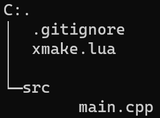

## 创建c++空工程

```
xmake create hello
cd hello 
tree /F#查看文件结构
```



### xmake.lua配置文件的结构

```lua
add_rules("mode.debug", "mode.release")

target("hello")
    set_kind("binary")
    add_files("src/*.cpp")
```

- `add_rules("mode.debug", "mode.release")`：可选配置，用于描述编译模式，默认情况下会采用 release 编译模式。
- `target("hello")`：定义一个目标程序。
- `set_kind("binary")`：指定编译生成的目标程序是可以执行的。
- `add_files("src/*.cpp")`：添加 src 目录下的所有 C++ 源文件。


## 编译工程

```
xmake #编译工程
...
tree /F #查看 xmake 生成了哪些文件
```

可以看到默认情况下，xmake 会自动在 build 目录生成可执行文件，其中还会自动创建 `windows/x86_64/release` 子目录，这是为了方便处理跨平台编译，如果一个项目同时需要编译各种平台、架构、编译模式下的目标文件，那么分别存储到不同的目录，可以互不影响。


### 运行程序

```
xmake run
```

xmake 会自动执行 build 目录下实际对应的可执行程序，然后加载运行，因此不需要用户手动去找对应的程序路径来执行，这样能够最大程度地简化用户的操作。

如果运行成功，就会在终端显示 `hello world!` 字符串。


## 调试程序

在开始调试前，我们需要先在当前环境安装下 gdb。

gdb 安装完成后，需要在之前的 hello 项目中，将编译配置切换到 debug 模式重新编译程序，使编译好的程序带上符号信息（这个时候会传递 -g 编译选项给 gcc），这样我们才能够在调试器中正常下断点进行源码调试。

因此我们先来重新编译下 debug 版本程序。

```
xmake f -m debug
xmake #编译
```

上面的 `xmake f -m debug` 就是切换的 debug 调试编译模式，保存配置后，重新执行 `xmake` 就可以编译生成带符号信息的 debug 程序。

编译好后，我们就可以加载调试器运行了，还是之前的 `xmake run` 命令，只不过追加了 `-d` 参数，告诉 xmake 当前我们需要调试运行程序，xmake 会自动检测当前环境存在的调试器，然后运行它去加载我们的程序。

```
xmake run -d
```

如果看到 gdb 已经正常把程序加载了，就可以执行下面的命令在 main 入口函数下个断点，然后继续输入 r 继续运行程序，直到 main 函数断点被正常触发中断。

```bash
gdb> b main
gdb> r
gdb> q   # 退出
```

断点正常触发后，我们就会看到实际断下的源码位置，这个时候可以继续使用 gdb 的其它调试命令来调试我们的程序了，关于 gdb 的使用细节，这里就不多讲了，这里主要是演示如何使用 xmake 去加载使用 gdb 调试器。


## 安装程序

调试程序成功后，如果我们的程序确实没什么问题了，那么就可以将其直接安装到系统中使用，不用每次都依赖 `xmake run` 来运行了。

执行如下命令就可以安装编译好的程序到系统环境。

```
xmake install -y
```

由于系统默认会将 xmake 安装到 `/usr/local` 目录下，需要系统权限，所以安装命令中带上了 -y 参数。

执行 `which hello` 查看安装好的程序存放在系统的哪个路径下。

可以看到，xmake 是把 hello 程序给安装到了系统 `/usr/local/bin/hello` 位置。


### 卸载程序

如果我们要卸载之前安装的程序，也是可以的，只需要在之前的项目根目录继续执行 `xmake uninstall -y` 完成卸载，-y 参数表示使用管理员权限。
