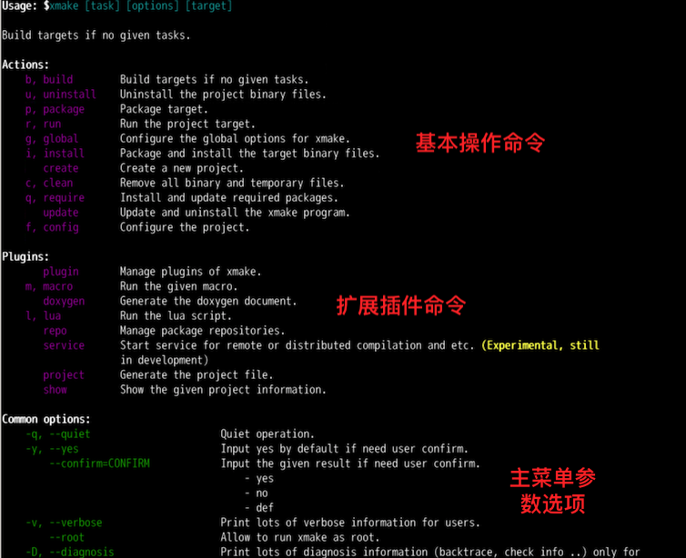
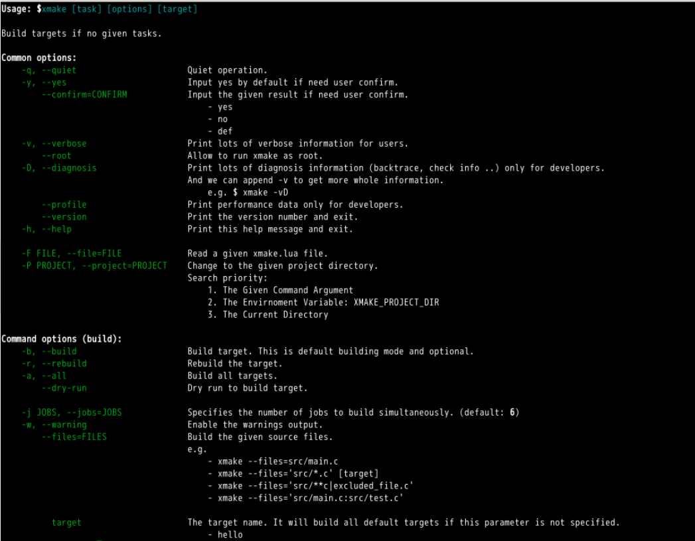
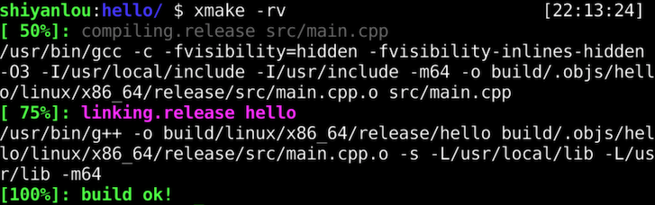
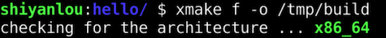
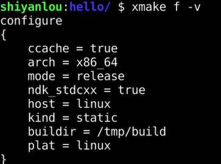

## 基本命令介绍

xmake 的整个命令行格式如下。

```bash
xmake [task] [options] [target]
```

主要由 `[task]`、`[options]` 还有 `[target]` 组成，其中 `[]` 部分表示可选输入，里面的 task 就是子命令任务名，xmake 提供了很多的内置子命令以及插件任务子命令，可以通过执行 `xmake --help` 在主菜单里面查看具体有哪些子命令，整个主菜单的列表内容如下。



而 `options` 就是指的上图中的参数选项，除了主菜单的参数选项，每个子命令也有对应的参数选项，比如 `xmake build --help` 就是 build 子命令的帮助菜单。

最后面的 `target` 指的是当前的命令是针对哪个目标程序的，这个也是可选的参数，并不是所有命令都有，主要是 build、install 等这些基础命令才提供，用于指定编译、安装对应的目标程序，而默认不指定，则会编译安装所有程序。

在上图中的 `Actions` 区域的子命令，就是用于跟构建相关的所有内置命令，而 `Plugins` 区域的子命令，是扩展的插件命令。这里我们主要简单介绍下 Actions 命令，其实很多在实验 1 《xmake 的基本使用》中都已经使用过。

- `config`：配置编译需要的参数，比如平台、架构等。
- `global`：全局配置编译参数。
- `build`：构建程序。
- `run`：运行目标程序。
- `install`：安装编译后的目标程序。
- `uninstall`：卸载之前安装的程序文件。
- `package`：打包编译生成的库和头文件。
- `clean`：清理编译过程中生成的临时文件。
- `require`：手动拉取第三方依赖库。
- `update`：xmake 程序自更新。


### build 子命令

build 子命令也就是默认的构建命令，由于这个命令最常用，因此即使用户不完整运行 `xmake build`，仅仅执行 `xmake` 就可以编译项目，两者是完全等价的。

如果我们要查看构建命令具体有哪些参数选项，可以执行下面的命令来查看，参数列表如下：

```bash
xmake build --help
```

输出内容如下。



我们可以看到，它主要分了两大类，上半段 `Common options` 部分是通用选项，所有子命令都会存在这些选项，下半段 `Command options (build)` 就是 build 子命令特有的选项列表。

这里仅仅介绍比较常用的几个选项。

- `-v/--verbose`：查看详细完整的编译命令。
- `-r/--rebuild`：强制重新编译所有代码。
- `-j/--jobs`：指定多任务编译的并行任务数。
- `-w/--warning`：编译过程中显示编译警告信息。


### 查看详细编译选项

通过添加 `-v` 参数，在编译过程中，查看完整的编译选项，这是非常有用的，可以排查和确认设置的编译选项是否生效，我们可以进入之前的 hello 项目中执行下面的命令。

```bash
xmake -rv
```

这里我们还同时追加 `-r` 选项，`-r` 和 `-v` 可以组合在一起变成 `-rv` 同时生效（这是由于 xmake 采用的是 unix 的命令参数风格），也就是重新编译并且显示详细命令输出，具体效果如图。




## config 子命令

config 子命令主要用于在编译前，对项目进行一些参数配置，比如切换平台、架构以及编译模式等，可用于修改编译过程中的各种行为，当然里面很多配置是可以直接在 xmake.lua 中配置来永久生效的，不过这里通过配置命令，也可以针对当前编译临时生效，配置结果也会被缓存。

需要注意的是，每次的配置都是完整配置，会完全覆盖上一次的配置结果。


### 切换到调试编译模式

编译模式的切换，在实验 1 《xmake 的基本使用》中已经讲解过，只需要执行。

```bash
xmake f -m debug
```

需要提示的一点是，`xmake f` 是 `xmake config` 的简写，用来简化输入提高效率，其它子命令也都是有简写的，大家可以在帮助菜单中查看。


### 切换编译输出目录

默认编译 xmake 会在当前项目根目录下生成 build 子目录作为编译输出目录，如果不想生成到当前目录下，我们可以通过下面的配置命令切换到其它输出目录下。



如果配置成功，通过下面的命令查看当前的配置信息，确认是否生效。




### 添加 C/C++ 编译选项

通过配置命令，我们可以在命令行中快速添加一些自定义的 C/C++ 编译选项，其中主要涉及这三个选项。

- `--cflags`：仅仅添加 C 编译选项。
- `--cxxflags`：仅仅添加 C++ 编译选项。
- `--cxflags`：同时添加 C/C++ 编译选项。

如果你的项目中既有 C 代码，也有 C++ 代码，那么使用 `--cxflags` 来同时设置会更加方便，使用方式如下。

```bash
xmake f --cxflags="-DTEST"
xmake -rv
```

我们通过执行 `xmake -rv` 强制重新编译并且显示详细输出，来确认是否添加生效，下图红框部分中的 `-DTEST` 说明我们添加的 TEST 宏定义确实传入了 gcc 编译器。


### 添加链接库和搜索路径

同样，除了 C/C++ 代码编译，最后的链接器阶段的选项，我们也可以通过 `--ldflags` 命令参数添加设置，例如。

```bash
xmake f --ldflags="-L/tmp -lpthread"
xmake -rv
```

我们通过添加额外的 pthread 链接库，同时新增了 `/tmp` 的库搜索目录，最后生效的效果如下。


另外，我们也可以通过 `--links` 和 `--linkdirs` 达到同样的效果。

```bash
xmake f --links="pthread" --linkdirs="/tmp"
xmake -rv
```


### 切换到 clang 编译器

默认情况下，在 Linux 环境中，xmake 会优先使用 gcc 编译器，不过我们也可以很方便地切换使用其它的编译器，比如 clang。

如果安装成功，执行下面的命令切换到 clang 编译工具链，然后执行编译。

```bash
xmake f --toolchain=clang
xmake -rv
```

我们可以看下执行的详细输出，红框部分显示的 `/usr/bin/clang` 说明当前的编译确实使用了 clang 编译器而不是 gcc 了。


我们再通过 `xmake run` 运行下编译好的目标程序。


正常显示 `hello world!`，一切运行正常。


### 重置所有配置

经过之前的一些配置，我们缓存了不少编译配置，如果想重置所有配置到最初的默认状态，那么可以添加 `-c` 选项来重置所有。默认配置下，也就是 release 编译模式，会忽略本地的配置缓存，像之前的编译输出路径、新增的编译选项配置都会被忽略。

```bash
xmake f -c
xmake -rv
```

重置配置后，我们重新编译当前工程，可以看下里面的详细编译选项，已经完全还原回去了。


## show 子命令

我们可以使用此命令，查看当前工程的基本信息，以及 xmake 自身的一些基本信息，这通常是非常有用的，比如可以知道当前项目有哪些目标程序，当前的编译架构和模式是什么，以及 xmake 的临时目录、缓存目录和安装路径在哪里等等。

```bash
xmake show
```

显示的一些信息如下图。


除了项目和 xmake 自身基本信息，show 命令还可以显示指定 target 目标的基本信息，比如我们执行下面的命令查看下在 xmake.lua 文件中定义的 `target("hello")` 目标程序的基本信息。

```bash
xmake show -t hello
```


通过上图，我们能大致了解这个 hello 程序的可执行文件的实际生成路径在哪里，编译过程中的 `.o` 文件在哪里，以及是在 `xmake.lua` 哪个位置定义的。


## update 子命令

如果 xmake 有新版本发布，我们也可以使用自更新命令快速更新版本，只需要执行下面的命令。

```bash
xmake update -f
```

这里我们额外加上了 `-f/--force` 参数，这是因为我们当前环境的 xmake 已经是最新版本，通常不需要更新，为了演示这个更新操作，我们通过这个参数来强制重新更新一遍当前的最新版本。


更新完成后，我们可以继续执行 `xmake --version` 确认下版本是否为最新版本，实际的版本号由于时间关系，会有所变动，毕竟 xmake 的版本迭代还是挺频繁的。


